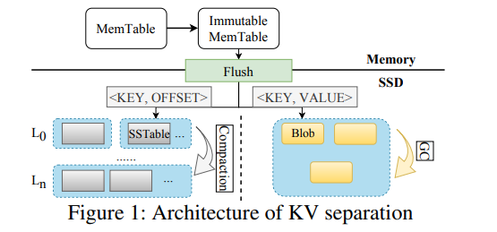
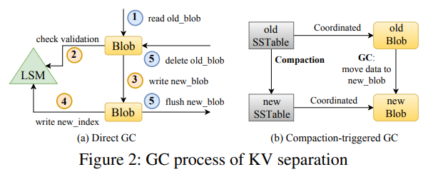
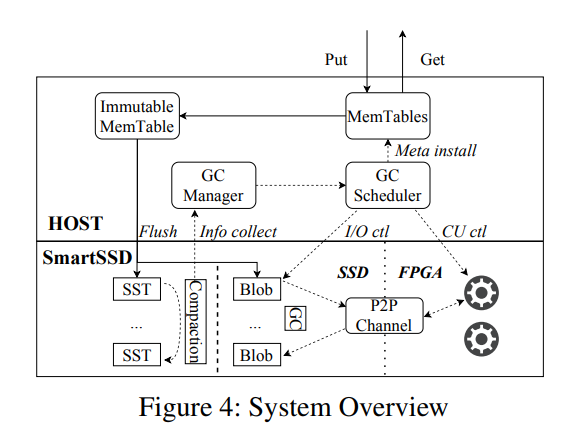
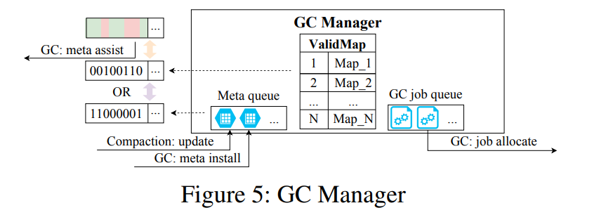
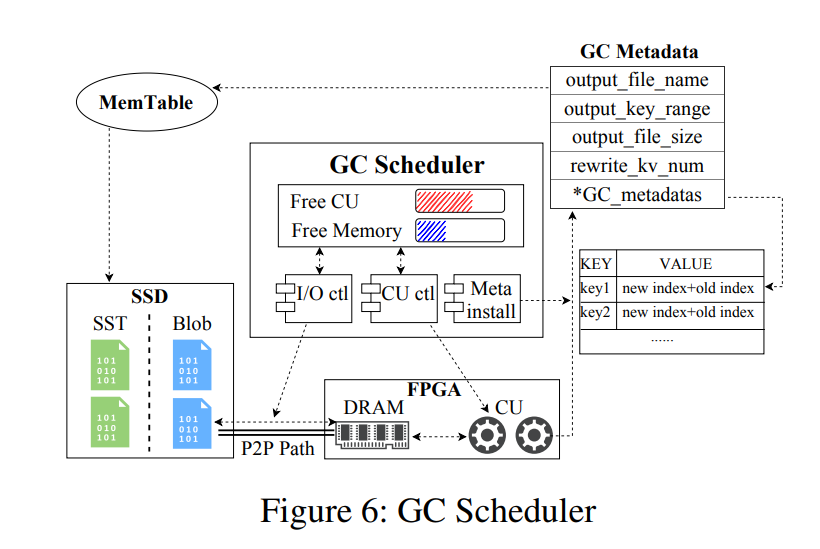
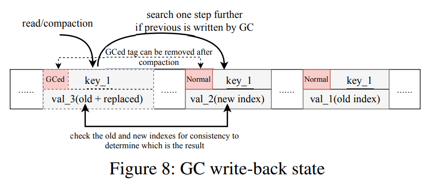
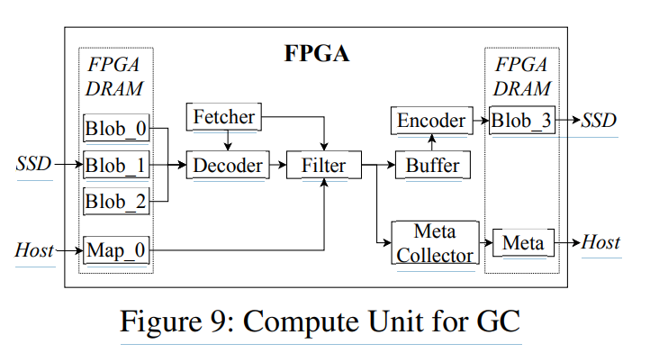

## 摘要

### 背景与挑战

*   **现有技术**：键值分离（Key-Value Separation）是缓解LSM树写放大问题的有效方法。
*   **新问题**：该技术引入了新的性能开销，尤其是在对值区域（Value Region）进行垃圾回收（GC）时。
*   **方案局限**：以往的优化方案试图在CPU和I/O开销之间权衡，但**无法同时满足**系统对 **高吞吐量、低尾延迟、低空间占用** 这三大核心指标的要求，导致实用性受限。

### 解决方案：AegonKV

AegonKV 提出了一种“一石三鸟”的解决方案，旨在同时优化上述三个指标。

*   **核心机制**：**基于智能SSD（SmartSSD）的GC卸载（Offloading）**。
*   **工作原理**：将LSM树中繁重的垃圾回收（GC）任务从主机CPU下沉到智能SSD上，让SSD在内部异步执行。
*   **核心优势**：这种方法避免了GC操作与用户正常的读写请求**争夺主机CPU和I/O带宽资源**。
*   **技术支撑**：为了实现高效卸载，AegonKV设计了专门的 **“对卸载友好的数据结构”** 和 **“软硬件协同执行逻辑”**。

### 核心成果与数据

实验证明，与现有的键值分离系统相比，AegonKV取得了全面的性能提升：

*   **吞吐量提升**：最高提升 **1.28 - 3.3倍**。
*   **尾延迟降低**：显著减少 **37% - 66%**。
*   **空间开销减少**：节省 **15% - 85%**。

### 总结：核心贡献

AegonKV的核心贡献在于，它创新地将LSM树上层的GC逻辑与存储设备（智能SSD）的计算能力相结合，通过“计算卸载”的方式，从根本上解决了主机侧GC带来的资源竞争问题，从而一举实现了吞吐量、延迟和空间效率的全面提升。

## 引言

### 1. 背景：LSM树的困境与初步解决方案

*   **LSM树的优势与挑战**:
    *   **优势**: 基于LSM树的键值存储因其将随机写转换为顺序写，拥有**极高的写入性能**，是现代数据密集型应用的核心。
    *   **挑战**: 其性能优势的代价是后台必须进行**合并（Compaction）**操作。这个过程需要反复读写数据，带来了巨大的I/O和计算开销，即**写放大**问题，成为性能瓶颈。

*   **初步解决方案：键值分离 (KV Separation)**:
    *   **核心思想**: 这是一种针对LSM树的巧妙优化。它将庞大的**值 (Value)** 从LSM树中分离出去，存放到一个独立的**值日志 (Value Log)** 区域。LSM树中只保留轻量的**键 (Key)** 和指向Value的**指针**。
    *   **带来的好处**: LSM树的合并（Compaction）过程从“搬运厚重的书”变成了“整理轻便的卡片”，只移动Key和指针，**极大地缓解了写放大问题**，尤其在Value很大的场景下效果显著。

### 2. 新问题：键值分离引入的GC开销

*   **新的挑战**: 解决了Compaction，但Value Log自身产生了新问题。随着数据更新和删除，Value Log中堆积了大量过期的、无效的Value，造成空间浪费。
*   **必要的GC机制**: 必须引入**垃圾回收 (Garbage Collection, GC)** 机制来清理Value Log。这个GC过程和LSM的Compaction惊人地相似：**读取旧数据 -> 筛选有效数据 -> 重写到新位置**。
*   **现有方案的局限**: 传统的GC在主机端（Host CPU）执行，会与用户的正常读写请求**争抢宝贵的CPU和I/O总线（PCIe）带宽**。此前的优化方案仅仅是在“多用点CPU”还是“多用点I/O”之间权衡，无法从根本上解决资源争抢问题，因此难以同时实现**高吞吐量、低尾延迟、低空间占用**这三个目标。

### 3. AegonKV的核心思路：利用智能SSD进行计算卸载

*   **破局点：计算与I/O的协同优化**:
    *   论文作者发现，智能SSD（SmartSSD）这种集成了计算单元（FPGA）和存储介质的设备，为解决GC问题提供了完美的平台。
    *   **核心思想**: 将整个GC任务从主机**卸载（Offload）**到智能SSD上执行。

*   **卸载带来的革命性优势**:
    1.  **资源隔离**: GC的数据读写在SSD的**内部总线**上完成，计算由**内部FPGA**负责。这套流程完全不占用**主机CPU**和**PCIe总线**，从而彻底消除了与用户请求的资源竞争。
    2.  **近数据处理**: 计算逻辑（GC）和数据（Value Log）在物理上紧密耦合，避免了数据在主机和SSD之间的长途跋涉，效率极高。
    *   **最终目标**: 首次提出利用GC卸载，来**同时优化**吞吐量、尾延迟和空间开销，实现“一石三鸟”。

### 4. 卸载带来的新挑战与AegonKV的解决方案

*   **挑战1：信息依赖**: GC判断一个Value是否有效，其唯一的“真理来源”是**主机端的LSM树**。庞大复杂的LSM树无法完全放入SSD。因此，SSD在执行GC时，必须与主机进行**高效、轻量级的通信**以获取决策信息。
*   **挑战2：硬件资源有限**: 智能SSD上的FPGA资源有限，必须精心设计卸载逻辑，在任务复杂度和硬件限制之间找到平衡。

*   **AegonKV的应对策略（软硬协同）**:
    *   **硬件层面 (FPGA)**: 设计了一套精心优化的**流水线化GC流程**，高效处理数据过滤、编解码、读写等“体力活”。
    *   **软件层面 (主机)**: 设计了一种**内存友好且低开销的数据结构**，在主机端实时追踪Value的失效状态。这不仅能帮助更智能地选择GC目标，还能为SSD端的硬件准备好必要的决策信息，使软硬件之间的通信更高效。

### 5. 成果与结论

*   **实现与对比**: AegonKV基于主流的KV分离系统Titan进行实现，并与RocksDB、Titan、DiffKV等多个系统进行了全面对比。
*   **显著的性能提升**: 实验结果表明，AegonKV实现了：
    *   **吞吐量提升**: **1.28 - 3.3倍**
    *   **尾延迟降低**: **37% - 66%**
    *   **空间开销减少**: **15% - 85%**

**总而言之，AegonKV通过将键值分离架构中开销巨大的GC任务，从主机CPU巧妙地卸载到智能SSD上，并设计了一套软硬件协同机制来解决卸载带来的新挑战，最终在不牺牲任何一方的情况下，全面提升了系统的核心性能指标。**

## 背景

### 2.1节 - 键值分离LSM树的核心工作原理与GC策略

这一节详细阐述了键值分离（KV Separation）架构的**动机、实现方式**，以及由此衍生的核心挑战——**垃圾回收（GC）**，并介绍了两种主流的GC实现策略。

#### 1. 键值分离架构：解决写放大的良药 (对应图1)

**动机**: 传统的LSM树将键（Key）和值（Value）作为一个整体存储在SSTable中。在合并（Compaction）时，为了排序和整理很小的Key，系统被迫反复读写庞大的Value，导致严重的**写放大**问题。

**实现方式 (如图1所示)**:

1.  **分离刷盘 (Flush)**: 当内存中的`MemTable`写满后，系统执行分离操作：
    *   **`<KEY, OFFSET>`**: 键和指向Value的地址指针（Offset）被写入LSM树区域，形成SSTable。
    *   **`<KEY, VALUE>`**: 完整的键值数据（主要是Value）被追加写入一个独立的日志结构区域，即**值区域（Value Region）**，通常由多个**Blob文件**组成。
2.  **两大独立区域**: 最终在磁盘上形成两个部分：
    *   **LSM树区域**: 体积很小，只包含SSTable。Compaction只发生在这里，因为它只整理轻量的`(Key, Pointer)`，所以**速度极快，写放大问题得到极大缓解**。
    *   **值区域**: 体积庞大，只包含Blob文件，负责存储真实的Value。

**结果**: 这种架构用“读取时多一次间接查找”的微小代价，换来了“写入和合并性能的巨大提升”。

#### 2. 新的挑战：分离后的两次清理工作

键值分离虽然巧妙，但也把原本一体化的清理工作拆分成了两个独立的任务，即我们讨论过的**“需要干两次活”**：
1.  **LSM树的Compaction**: 负责整理Key和指针。
2.  **值区域的GC**: 负责清理Compaction后产生的、无人引用的垃圾Value。

本节的后半部分，重点介绍了实现GC的两种主流策略：

#### 策略一：直接GC (Direct GC) - 独立但干扰大 (对应图2a)

这是以Titan为代表的实现方式。GC是一个独立于Compaction运行的后台进程。

**工作流程 (如图2a所示)**:
1.  **`① read old_blob`**: GC进程选择一个“最脏”的旧Blob文件开始扫描。
2.  **`② check validation`**: **(核心瓶颈)** 对于读出的每一个Value，GC都必须**回头查询主机端的LSM树**，询问：“这个Value对应的Key还活着吗？指针还是指向这里吗？” 这一步会产生大量查询，与用户请求**争抢LSM树的资源**。
3.  **`③ write new_blob`**: 如果Value是有效的，就将其重写（搬运）到一个新的Blob文件中。
4.  **`④ write new_index`**: **(第二个瓶颈)** 因为Value的位置变了，GC还必须把新的地址**写回到LSM树中**，更新指针。这又是一次对LSM树的写入干扰。
5.  **`⑤ delete old_blob / flush new_blob`**: 完成搬运后，删除旧文件，持久化新文件。

**总结**: 这种方式虽然灵活，但GC过程与LSM树之间存在**紧密的、有害的耦合**。GC的运行会严重干扰前台LSM树的正常读写，导致性能抖动。

---

#### 策略二：Compaction触发式GC - 集成但欠灵活 (对应图2b)

这是以DiffKV、BlobDB为代表的实现方式。它试图将GC和Compaction重新“绑定”在一起，实现“一次完成”。

**工作流程 (如图2b所示)**:
1.  **强绑定**: 系统维护了一个从SSTable到Blob文件的映射关系。一个`old SSTable`的所有Key，其Value都集中在对应的`old Blob`中。
2.  **协调触发 (Coordinated)**: 当LSM树对`old SSTable`进行**Compaction**时，会**同时触发**对`old Blob`的GC。
3.  **一体化处理**: Compaction进程在判断出`old SSTable`中的哪些Key是有效的同时，**顺便**就将这些有效Key对应的Value从`old Blob`搬运到`new Blob`。
4.  **统一输出**: Compaction的最终产物是`new SSTable`（包含Key和指向新位置的指针）和`new Blob`（包含搬运过来的有效Value）。

**总结**: 这种方式巧妙地利用了Compaction自身的信息，**完全避免了对LSM树的额外查询和写回（图2a中的步骤②和④）**。但代价是**加重了Compaction本身的负担**，并且GC的执行时机完全依赖于Compaction，不够灵活，可能导致空间无法及时回收。

**本节的论述为AegonKV的提出奠定了基础：既然基于Titan的“直接GC”策略其主要瓶颈在于与LSM树的交互，那么如果能将这个交互过程的大部分开销卸载掉，就能在保持其灵活性的同时，解决其性能问题**

**。**

### 2.2节 - 智能SSD：为计算卸载而生的硬件基石

本节介绍了AegonKV解决方案得以实现的技术基石——三星智能SSD（Samsung's SmartSSD）。它是一种前沿的**近数据处理（Near-Data Processing）**设备，其核心思想是在存储设备内部集成计算能力，从而在最靠近数据的地方进行处理。

#### 核心架构特性

1.  **硬件三位一体**：SmartSSD将三个核心部件无缝集成在一块设备上：
    *   **SSD**：标准的高速NVMe固态硬盘。
    *   **FPGA**：一个可编程的计算单元，相当于SSD的“大脑”。
    *   **板载DRAM**：一块FPGA专用的高速内存，用作计算时的缓存或工作区。

2.  **内部高速公路 (P2P通信)**：这是SmartSSD最关键的特性。数据可以在其内部的SSD闪存和FPGA板载DRAM之间通过**内部总线直接传输**。
    *   **比喻**: 这就像一个工厂内部建了传送带，原材料（数据）无需出厂（离开SSD）就能直接送到车间（FPGA）进行加工。

#### 带来的革命性优势

利用上述架构，将计算任务（如本文中的GC）**卸载（Offload）**到SmartSSD上，可以带来两大好处：

1.  **绕过主机开销，消除资源竞争**:
    *   **数据传输**: 由于GC的数据搬运在SSD内部完成，**完全不占用主机与设备之间的PCIe总线带宽**。
    *   **计算任务**: GC的逻辑在FPGA上运行，**完全不消耗主机CPU资源**。
    *   **操作系统**: 数据处理绕过了操作系统内核复杂的I/O栈，延迟更低，效率更高。

2.  **显著减少数据移动**: 计算在最靠近数据的地方发生，避免了将海量数据在主机内存和存储设备之间来回拷贝的低效过程，同时也降低了能耗。

#### 结论

这一节为论文的核心方案——GC卸载——提供了完美的硬件基础。SmartSSD的特性（特别是P2P通信）恰好解决了传统GC方法中，后台任务与前台请求争抢主机CPU和I/O带宽的核心痛点，使得**高效、无干扰的后台数据整理**成为可能。

## 动机与挑战

本节通过一系列**诊断性实验**，系统地剖析了现有键值分离方案的内在矛盾，精准定位了性能瓶颈，从而为论文后续提出的、基于智能SSD的卸载方案**奠定了坚实的动机和理论基础**。

### 1. 实验设置：在公平的环境下诊断问题

*   **目标**: 证明所有现存主流方案都存在无法解决的根本性缺陷。
*   **平台**: 采用一台标准的高性能服务器，其搭载的智能SSD**关闭了硬件卸载功能**，仅作为一块普通的高速NVMe硬盘使用。
*   **选手**:
    *   **传统LSM代表**: RocksDB
    *   **KV分离代表**:
        *   Titan (采用**直接GC**策略)
        *   BlobDB / DiffKV (采用**Compaction触发式GC**策略)
*   **评估维度**: 除了常规的**吞吐量**和**99%尾延迟**，还引入了**空间开销**、**合并I/O**和**写停顿**，以进行更全面的“体检”。

### 2. 核心发现：现有方案陷入“跷跷板”困境

实验结果（Table 1）清晰地揭示了两种GC策略之间不可调和的矛盾：

*   **Compaction触发式GC (BlobDB/DiffKV) - “性能优先，空间其次”**:
    *   **优点**: **吞吐量高、尾延迟低**。因为它将GC与Compaction绑定，避免了GC对LSM树的额外读写干扰。
    *   **缺点**: **空间浪费极其严重** (高达155GB)，且**加重了Compaction负担**导致写停顿。原因是GC不及时、不彻底。

*   **直接GC (Titan) - “空间优先，性能其次”**:
    *   **优点**: **空间效率极高** (仅31GB)，**合并开销和写停顿最低**。因为它能灵活、及时地回收垃圾。
    *   **缺点**: **吞吐量和尾延迟表现最差**，性能甚至不如未经优化的RocksDB。

**初步结论**: 现有方案无法同时兼顾**性能、延迟、空间**这三个核心指标，陷入了顾此失彼的权衡困境。

### 3. 深入诊断：锁定Titan的性能元凶

作者对表现反常的Titan进行了层层深入的“破案式”分析：

1.  **大胆假设 (关闭GC)**: 通过关闭Titan的GC功能进行对比测试（Table 2），发现其**吞吐量飙升67.7%，尾延迟骤降69.1%**。
    *   **结论**: 这无可辩驳地证明了，**拖垮Titan的不是键值分离架构本身，而是其GC的实现方式**。

2.  **定位犯罪现场 (资源竞争分析)**:
    *   在限制CPU资源的环境下，开启GC的Titan性能进一步**骤降22.9%**，表明GC与前台请求在激烈地争抢CPU资源。
    *   通过对GC各阶段耗时进行细分（Table 3），发现**超过91%的时间都消耗在与LSM树的交互上**（`Read LSM`: 25.3%, `Write LSM`: 65.93%）。

**最终诊断**: Titan（直接GC）的性能瓶颈在于，其GC过程需要与主机端的LSM树进行**大量、高频、昂贵的读写交互**，这些交互与用户请求**激烈地争抢主机CPU和I/O总线带宽**，从而严重拖累了系统整体性能。

### 4. 提出解决方案并预见挑战

基于上述诊断，作者顺理成章地提出了解决方案及其合理性：

*   **解决方案**: 在**智能SSD**上通过**近数据处理**来优化**直接GC**。
*   **为什么完美匹配**:
    1.  **解决I/O瓶颈**: 智能SSD的**内部总线 (P2P)** 可以让GC的数据搬运**绕过PCIe总线**，消除带宽竞争。
    2.  **解决计算瓶颈**: **FPGA**非常适合执行GC这种流式、可并行的**流水线化任务**，从而解放主机CPU。

*   **预见的挑战**: 作者坦诚地指出了该方案需要攻克的三大技术难题：
    1.  **回读查询 (Read Back Travel)**: 如何解决SSD在执行GC时，必须查询主机端LSM树这一信息依赖问题。
    2.  **资源限制 (Resource Limitation)**: 如何在FPGA有限的硬件资源下，设计出轻量而高效的GC逻辑。
    3.  **额外数据移动 (Extra Data Movement)**: 如何高效调度那部分不可避免的、需要从SSD回传到主机的数据流，以防造成拥堵。

本节通过严谨的实验和逻辑推理，清晰地论证了现有方案的不足，指明了优化方向，并为后续章节将要阐述的、基于硬件卸载的AegonKV系统，提供了充分且必要的动机。

## 设计和实现

本节详细介绍了AegonKV的系统架构（如图4所示），它基于Titan构建，并开创性地在智能SSD上实现了GC卸载。其核心设计思想是**主机（HOST）软件与智能SSD（SmartSSD）硬件的深度协同**，通过一系列精心设计的组件来克服GC卸rade载的三大挑战。

#### 整体架构概览 (参照图4)

AegonKV的架构分为两大域：

1.  **主机域 (HOST)**：
    *   **保留了Titan的基础结构**: 包括`MemTable`、LSM树的`Compaction`和`Flush`等核心数据流。
    *   **新增两大核心组件**: `GC Manager` 和 `GC Scheduler`，它们是整个卸载策略的“大脑”和“指挥中心”。

2.  **智能SSD域 (SmartSSD)**：
    *   **FPGA作为执行单元**: GC的核心逻辑单元被实现在FPGA上。
    *   **P2P通道**: 利用SmartSSD的**P2P（点对点）通道**，实现SSD内部闪存与FPGA之间的高速数据传输，**绕过主机**。

#### 核心组件及其职责

AegonKV的设计通过以下组件，精准地解决了之前提出的挑战：

1.  **GC管理器 (GC Manager)** - **解决“回读查询”问题**
    *   **职责**: 它是主机端的信息中心，负责**预先**计算和管理Value的有效性。
    *   **核心工具**: 引入`ValidMap`数据结构（一个高效的位图）。
    *   **工作流程**:
        *   `Info collect`：通过观察LSM树的`Compaction`过程，`GC Manager`能实时知道哪些Value已经过期。
        *   `ValidMap update`：它将这些“生死信息”高效地记录在`ValidMap`中。
        *   当下发GC任务时，它会将对应的`ValidMap`一并交给SSD。
    *   **效果**: SSD在执行GC时，只需查阅本地的`ValidMap`即可，**无需再回头向主机发起昂贵的查询请求**。

2.  **GC调度器 (GC Scheduler)** - **解决“硬件资源有限”和“额外数据回传”问题**
    * **职责**: 它是主机端的总指挥，负责精细化地调度和管理整个卸载任务的生命周期。
    
    *   **三大子模块**:
        1. **`I/O ctl` (I/O控制)**: 指挥SSD何时、如何通过P2P通道读取旧Blob文件、写入新Blob文件。
        
        2. **`CU ctl` (计算单元控制)**: 管理FPGA计算资源的分配，何时启动计算，何时结束。
        
        3. **`Meta install` (元数据安装)**: 负责将GC完成后的结果（即Value的新地址）**高效、批量地**安装回主机端的LSM树中，以解决回传瓶颈。
        
           

### 4.1 GC Manager

图5详细展示了`GC Manager`的内部设计，它是AegonKV主机端软件的核心组件，其根本目标是解决“回读查询”的性能瓶颈。它通过一个名为`ValidMap`的巧妙设计，扮演了**连接LSM Compaction与硬件GC的桥梁**角色。

#### 核心组件与数据结构

1.  **`ValidMap` (核心数据结构)**:
    *   **本质**: 一个内存中的**位图（Bitmap）数组**。`Map_1`, `Map_2`, ..., `Map_N` 分别一一对应磁盘上的 `Blob_1`, `Blob_2`, ..., `Blob_N` 文件。
    *   **功能**: `Map_N` 中的每一个比特位记录了`Blob_N`文件中对应位置Value的生死状态（**0=有效, 1=无效**）。
    *   **优势**: 空间占用极小（一个32MB的Blob文件，其ValidMap仅需4KB），且硬件处理效率极高。

2.  **`GC job queue` (GC任务队列)**:
    *   **功能**: 这是一个任务池。`GC Manager`会根据`ValidMap`分析出哪些Blob文件的“垃圾率”最高，最值得被回收。然后它会把这些待清理的Blob文件封装成GC任务，放入这个队列中。
    *   **流向**: `GC: job allocate`箭头指示，`GC Scheduler`（调度器）会从这个队列中取出任务，并开始执行卸载流程。

3.  **`Meta queue` (元数据队列)**:
    *   **功能**: 这是一个信息输入队列，用于接收所有可能影响`ValidMap`的元数据更新事件。
    *   **信息来源**:
        *   **`Compaction: update`**: 这是最主要的信息来源。LSM的Compaction完成后，会将所有被它清理掉的旧指针信息打包，作为一个更新事件放入`Meta queue`。
        *   **`GC: meta install`**: 当一次硬件GC完成后，其结果（比如Value的新地址）被安装回LSM树，这个过程也可能产生需要更新`ValidMap`的元数据。

#### 关键工作流程 (如图左侧所示)

`GC Manager`的核心工作是**异步地、高效地维护`ValidMap`的准确性**。图左侧生动地展示了这个流程：

1.  **接收更新**: `Compaction`完成后，将一份包含“失效指针”信息的更新包，通过`Compaction: update`推送到`Meta queue`中。

2.  **处理更新**: `GC Manager`从`Meta queue`中取出这份更新包。

3.  **构建临时位图**: 它会遍历更新包里的信息，并构建一个**临时的、稀疏的位图**。例如图中的`11000001`，只有那些刚刚被Compaction宣告无效的位置才被标记为`1`。

4.  **按位或 (OR) 操作**: 这是最关键的一步。`GC Manager`将这个临时位图与内存中对应Blob文件的**当前`ValidMap`**（如图中的`00100110`）进行**按位或（bit-wise OR）**操作。
    *   `00100110` OR `11000001` = `11100111` (未在图中画出结果，但这是其逻辑)
    *   **效果**: `OR`操作的特性是“有1则1”。这确保了`ValidMap`的状态只会从“有效(0)”变为“无效(1)”，**永不逆转**。它将新的失效信息安全地、高效地合并到了全局状态中。

5.  **为GC提供辅助**:
    *   **`GC: meta assist`**: 当`GC Scheduler`准备卸载一个GC任务时，它会向`GC Manager`请求辅助信息。`GC Manager`会提供最新的、准确的`ValidMap`（如图中上方的绿色/粉色条，代表一个更宏观的垃圾分布视图），连同GC任务一起下发给SSD。

#### 总结

`GC Manager`通过这套精巧的设计，实现了以下目标：

*   **解耦**: 将LSM Compaction的“信息产出”与硬件GC的“信息消费”在时间上**解耦**。Compaction只管产生信息，GC Manager负责异步处理，硬件GC在需要时直接获取最终结果。
*   **高效**: 利用位图和按位或操作，以**极低的计算和空间开销**维护了全局Value的有效性状态。
*   **消除回读**: 最终产出的`ValidMap`作为一份完整的“生死簿”下发给硬件，**从根本上消除了**SSD在执行GC时对主机的实时查询需求。

### 4.2 GC Scheduler 

图6生动地展示了`GC Scheduler`如何作为一个精密的项目管理办公室，全面负责和调度GC卸载任务。它通过内部三大模块的协同工作，解决了**硬件资源有限**和**数据回传拥堵**两大核心挑战。

#### 1. 核心组件与职责 (图中`GC Scheduler`框内)

*   **资源监控面板**:
    *   `Free CU` / `Free Memory`：调度器时刻监控着智能SSD上**空闲计算单元（CU）**和**空闲板载DRAM内存**的状态。这就像项目经理的资源看板，让他知道有多少“工人”和“场地”可用。

*   **三大职能模块**:
    1.  **`I/O ctl` (I/O控制器)**: 负责所有的数据流转。
        *   **向下**: 它通过**`P2P Path`**指挥SSD将目标`Blob`文件的数据读入FPGA的`DRAM`中。
        *   **横向**: 管理SSD内部新旧`Blob`文件的读写。
    2.  **`CU ctl` (计算单元控制器)**: 负责“派活”给FPGA。
        *   **向下**: 当数据准备好后，它向FPGA的**`CU` (齿轮图标)**下发计算指令，启动GC流程。
        *   **向上**: 监控`Free CU`状态，确保不会超额分配任务。
    3.  **`Meta install` (元数据安装器)**: 负责GC任务的“收尾”工作。
        *   **向右**: 当CU完成计算后，`Meta install`会接收到包含所有结果的**`GC Metadata`**。
        *   **向上**: 它会将这份元数据以**批量、有序**的方式，安装回主机端的`MemTable`或LSM树中，完成指针的最终更新。

#### 2. 完整工作流程的可视化解析

我们可以沿着图中的虚线箭头，串联起一次完整的、由`GC Scheduler`主导的卸载任务：

1.  **资源检查与任务启动**: `GC Scheduler`检查到有空闲的`CU`和`Memory`，决定启动一个GC任务。
2.  **数据准备 (由 `I/O ctl` 主导)**:
    *   调度器命令SSD，通过**`P2P Path`**（图中SSD和DRAM之间的双向粗箭头）将目标`Blob`文件（蓝色文件图标）的数据加载到FPGA的`DRAM`（内存条图标）中。
3.  **计算执行 (由 `CU ctl` 主导)**:
    *   数据加载完毕后，调度器命令`CU`（齿轮图标）开始工作。`CU`从`DRAM`中读取数据，执行GC逻辑（过滤无效Value），并将有效的Value再写回`DRAM`中的输出缓冲区。
4.  **结果回传 (由 `I/O ctl` 主导)**:
    *   计算完成后，调度器命令SSD，再次通过`P2P Path`，将`DRAM`中整理好的有效数据写回为一个新的`Blob`文件。
5.  **元数据处理 (由 `Meta install` 主导)**:
    *   `CU`在计算过程中，会生成一份详细的**`GC Metadata`**报告。这份报告（如图右上角框所示）包含了：
        *   新Blob文件的基本信息 (`output_file_name`, `size`等)。
        *   一个包含所有被搬运的Key及其**新旧地址**的详细列表 (`*GC_metadatas`)。
    *   `Meta install`模块接收到这份报告，并将其放入内部的缓冲队列。
6.  **最终安装**: 在合适的时机，`Meta install`将缓冲的元数据**批量地**应用到`MemTable`中，完成LSM树索引的最终更新。图中从`GC Metadata`指向`MemTable`的虚线正代表了这一最终步骤。

#### 总结

`GC Scheduler`通过这种精细化的分工与调度，将一个原本混乱、充满资源竞争的GC过程，转变为一个**高度自动化、资源可控、流程清晰**的卸载任务。它像一个经验丰富的项目经理，确保了在有限的资源（`Free CU/Memory`）下，高效地完成了从数据输入（`I/O ctl`）、处理（`CU ctl`）到结果交付（`Meta install`）的全过程，最大化地发挥了智能SSD的潜力，同时将对主机的干扰降到了最低。

### 4.3节 GC友好元数据安装

本节是AegonKV技术深度最强的部分，它通过一种名为**“延迟验证”（Deferred Validation）**的精妙算法，解决了在进行GC结果批量写回时，可能出现的**严重数据一致性问题**。

#### 1. 问题：天真的批量写回会导致数据丢失 (参照图7)

*   **场景描述**: 图7描绘了一个典型的并发写入冲突。LSM树的版本链按照**从右到左**的顺序变新（`Order of search visibility`）。
    1.  **`① GC input data`**: GC开始时，`key_1`的最新版本指向`val_1`。
    2.  **`② write during GC`**: 在GC执行期间，一个用户请求将`key_1`更新为指向`val_2`。**`val_2`是当前真正的最新版本**。
    3.  **`③ GC output, write after GC`**: GC完成了对`val_1`的搬运，生成了指向`val_3`的新版本。但这个版本是**基于过时信息（`val_1`）**生成的。
*   **冲突结果**: 如果GC盲目地将它的过时结果`val_3`写入LSM树，因为它写入的时间最晚，所以它会错误地**覆盖**掉用户写入的、本应是最新的`val_2`，导致**数据丢失**。

*   **传统解决方案的困境**: 唯一的办法是在GC写回前先**查找（lookup）**一次LSM树进行验证，但这会带来巨大的性能开销，使批量优化的意义荡然无存。

#### 2. 解决方案：延迟验证 - “写入时信任，读取时怀疑” (参照图8)

AegonKV创新地将验证的责任从**写入方（GC）**转移到了**读取方（`Get` / `Compaction`）**。

##### 写入阶段：
*   GC写回的结果（如图8中的`val_3`）被**直接、无验证地**写入LSM树。
*   为了区分，它被打上一个特殊的**`GCed`**标签（GC write-back state），意为“此条目由GC生成，版本存疑”。
*   这个`GCed`条目除了新地址`val_3`，还额外记录了它搬运前的**旧地址`val_1`**。

##### 读取/合并阶段 (如图8所示):
当`read/compaction`（即`Get`或`Compaction`操作）开始查找`key_1`时，会发生以下情况：

1.  **遇到`GCed`标记**: 查找首先命中了最新的、带有`GCed`标记的`val_3`。系统看到这个标记，立刻启动验证程序。
2.  **向后多看一步 (`search one step further`)**: 系统不会立即采纳`val_3`，而是**继续向后查找**，找到了下一个版本，即指向`val_2`的普通（`Normal`）条目。
3.  **进行比对裁决 (`check the old and new indexes`)**:
    *   系统取出`val_3`条目中记录的旧地址（即`val_1`）。
    *   它将这个旧地址`val_1`与刚刚向后找到的`val_2`条目的地址进行比较。
    *   **因为`val_1`不等于`val_2`**，系统推断出：在GC搬运`val_1`的期间，一个更新的版本`val_2`被写入了。
    *   **最终裁决**: `val_2`才是真正的最新版本。`Get`操作会返回`val_2`，而`Compaction`操作会丢弃`val_3`并保留`val_2`。**数据一致性得到了保证**。

4.  **“洗白”与收敛 (`GCed tag can be removed after compaction`)**:
    *   当`Compaction`完成了上述裁决后，它会将最终胜利的版本（无论是`val_2`还是`val_3`）**“晋升”**为一个**不带`GCed`标记**的普通数据，再写入新的SSTable。
    *   这个“洗白”过程确保了需要特殊验证的`GCed`条目只是**临时存在**的，最终会被系统的常规维护流程自动清理。

#### 结论

“延迟验证”策略是一个典型的**空间换时间**和**算法换性能**的范例。它通过：
1.  给GC写回的元数据增加**少量额外信息**（`GCed`标记和旧地址）。
2.  在**低频次**的读取和合并路径上增加一点**额外的比较逻辑**。

成功地将一个**高频次、发生在写入路径上、严重影响性能**的同步验证操作，转变为一个**对整体性能影响微乎其微**的异步验证机制，最终实现了**既安全又高效**的元数据批量安装。

### 4.4 Compute Unit for GC - 高效的硬件流水线工厂

本节深入到硬件实现层面，如图9所示，详细描绘了GC计算单元（CU）在FPGA内部如何被设计成一个**高度并行、流式处理的硬件流水线**。这个设计充分发挥了FPGA的优势，将GC任务拆解为简单、高效的步骤。

#### 1. 输入阶段：数据源源不断

*   **双路输入**: CU接收两种完全不同的数据流：
    1.  **数据流 (来自`SSD`)**: `Blob_0`, `Blob_1`, `Blob_2` 等多个待清理的Blob文件。它们从SSD通过P2P通道直接流入FPGA的板载`DRAM`作为输入缓冲区。
    2.  **指令流 (来自`Host`)**: `Map_0` 等与Blob文件一一对应的`ValidMap`位图。它们由主机下发，同样存放在`FPGA DRAM`中，作为GC的“操作手册”。
*   **流式处理**: 这里的输入被设计为“无限制的流式输入”，意味着FPGA可以持续处理数据，而无需等待整个文件加载完毕，体现了用小内存处理大数据的核心思想。

#### 2. 处理阶段：三级流水线作业

FPGA的核心处理逻辑被设计成一个经典的三级流水线，数据在其中单向流动和处理：

*   **第一级：解码与取回 (`Decoder` & `Fetcher`)**
    *   `Decoder`: 负责解析从DRAM中读出的原始Blob数据流，将其转换为内部模块可以理解的格式（比如识别出每个KV的边界）。
    *   `Fetcher`: 这是一个控制模块，它根据`Filter`的指令，告诉`Decoder`是应该**完整地取回**当前这个KV的数据，还是应该**直接跳过**它。

*   **第二级：过滤 (`Filter`) - 流水线的“大脑”**
    *   **核心决策单元**: `Filter`是整个流水线的中枢。它**同时**接收来自`Decoder`的数据流信息和来自`ValidMap`（`Map_0`）的有效性信息。
    *   **工作原理**: 对于`Decoder`正在处理的第 N 个KV，`Filter`会去查`ValidMap`的第 N 个比特位。
        *   **若为0 (有效)**: 它向`Fetcher`发送“取回”信号，并允许该KV数据流向下游的`Buffer`传递。
        *   **若为1 (无效)**: 它向`Fetcher`发送“跳过”信号，并**截断**该KV数据流，不让其进入下一阶段。

*   **第三级：缓冲与编码 (`Buffer`, `Encoder`, `Meta Collector`)**
    *   **数据路径**:
        *   `Buffer`: 一个缓冲区，用于平滑从`Filter`过来的有效数据流，确保后端`Encoder`能稳定地工作。
        *   `Encoder`: 负责将`Buffer`中的有效KV数据，重新打包成标准的Blob文件格式，存入输出缓冲区`Blob_3`。
    *   **信息路径**:
        *   `Meta Collector`: 一个元数据收集器。在数据流经时，它会同步地收集和统计关键信息，比如总共搬运了多少个KV、新文件的总大小、每个KV的新旧地址等。

#### 3. 输出阶段：数据与信息分道扬镳

流水线处理完成后，产生两种截然不同的输出：

1.  **新数据文件 (输出到 `SSD`)**:
    *   存放在输出缓冲区`Blob_3`中的、已经清理干净的有效数据，会再次通过P2P通道被直接写回到SSD上，形成一个新的Blob文件。**这个过程完全在设备内部闭环，无需主机干预**。

2.  **元数据报告 (输出到 `Host`)**:
    *   `Meta Collector`收集整理好的元数据报告（`Meta`），会被发送回主机端，交由`GC Scheduler`的`Meta install`单元进行后续的LSM树索引更新。

**总结**: 这个FPGA设计堪称典范。它将一个复杂的GC任务，巧妙地分解为**解码、过滤、编码**三个独立的流水线阶段，实现了**高度并行和流式处理**。通过让数据（Blob）和指令（ValidMap）在硬件内部高效协同，它用极低的计算开销完成了海量数据的清理工作，并将结果清晰地分为“留在设备内的数据”和“返回给主机的信息”，是整个AegonKV方案能够实现高性能的硬件基础。

