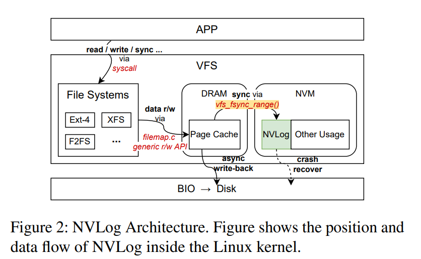
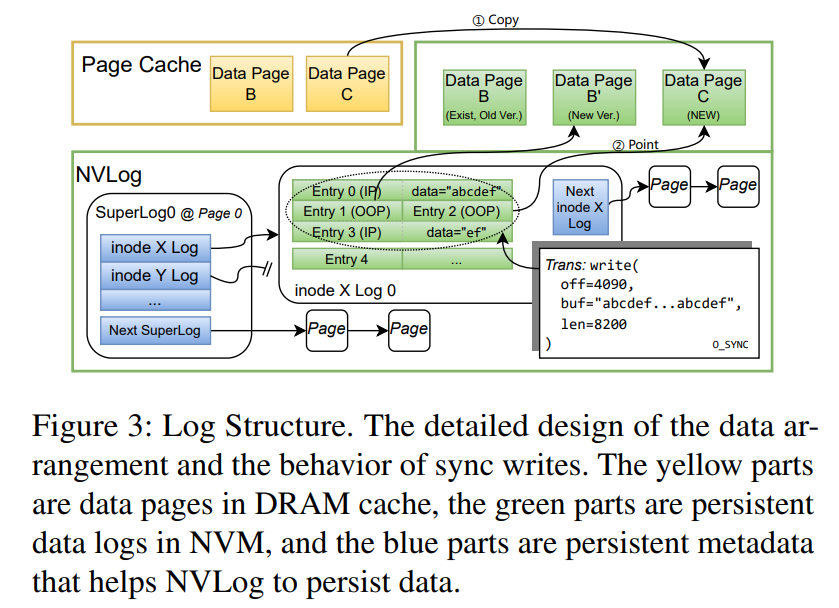

## 基本信息

-   **论文**: Boosting File Systems Elegantly: A Transparent NVM Write-ahead Log for Disk File Systems
-   **作者**: Guoyu Wang, Xilong Che, Haoyang Wei, Shuo Chen, Puyi He, and Juncheng Hu (Jilin University)
-   **发表**: FAST '25


## **摘要**

#### **核心思想**
提出一个名为 **NVLog** 的系统，它利用高速 NVM（非易失性内存）作为现有磁盘文件系统（如 ext4, XFS）的**透明预写日志（Write-ahead Log）加速层**，旨在不修改原文件系统的情况下，大幅提升其性能，特别是针对缓慢的同步写操作。

#### **关键技术与设计**
- **按需同步写吸收 (On-demand Sync Absorption):** 专门拦截并吸收文件系统中最耗时的同步写操作，将其写入高速NVM，从而让应用快速返回。
- **异构崩溃一致性 (Heterogeneous Crash Consistency):** 设计了专门的机制，确保在系统崩溃时，NVM日志和后端磁盘之间的数据状态能够保持一致。
- **高效日志与空间管理 (Efficient Logging & Space Management):** 采用优化的日志结构，并只临时占用NVM空间，通过垃圾回收（GC）机制高效管理空间。
- **保留DRAM快速路径 (Preserves DRAM Fast Path):** 不干扰原有的异步写操作，让它们继续利用高速的DRAM缓存。

#### **主要优势**
- **透明且无侵入 (Transparent & Non-Intrusive):** 无需修改现有文件系统或内核代码，易于部署。
- **无需数据迁移 (No Data Migration):** 可以直接在现有文件系统上启用，避免了将全部数据迁移到新文件系统的巨大开销。
- **轻量且稳定 (Lightweight & Stable):** 相比其他方案，设计更轻量，且依托于成熟的内核软件栈，稳定性高。

#### **性能亮点**
- **大幅加速传统文件系统:** 可将磁盘文件系统的性能提升高达 **15.09倍**。
- **超越NVM原生文件系统:** 在特定场景下，其性能甚至优于专门为NVM设计的 **NOVA** 文件系统（高达 **3.72倍**）和 **SPFS** 文件系统（高达 **324.11倍**）。


## **引言**

#### 1. 背景：NVM带来的机遇与挑战
- **机遇**: 非易失性内存（NVM）作为一种新型存储介质，具备持久化和字节可寻址的特性，有潜力加速传统存储并保证数据一致性。
- **挑战**: 将 NVM 与传统的 DRAM 和磁盘结合，形成了一个复杂的**异构存储系统**，给软件设计带来了巨大挑战，包括如何平衡不同介质的性能、如何避免软件栈成为瓶颈、以及如何保证跨设备的数据一致性。

#### 2. 现有方案的不足 (Critique of Existing Solutions)
论文系统性地分析了当前利用NVM的三类主流方法的缺陷：
- **NVM原生文件系统 (如 NOVA)**:
    - **缺点1 (容量限制)**: NVM 容量远小于磁盘，限制了其作为主存储的广泛应用。
    - **缺点2 (性能陷阱)**: 严重依赖 DAX（直接访问）模式，但由于 NVM 速度仍慢于 DRAM，在许多场景下性能反而**不如传统的 DRAM 页面缓存 (Page Cache)**。
- **跨介质文件系统**:
    - **缺点**: 设计过于复杂，不够成熟和稳健；与现有文件系统不兼容，导致**数据迁移成本极高**。
- **NVM作为加速层 (如 SPFS, P2CACHE)**:
    - **缺点**: 设计存在副作用。SPFS 引入了额外的索引开销和访问降速问题；P2CACHE 为了强一致性，不必要地**拖慢了本应很快的异步写入**。
    - **根本原因**: 这些方案采用了“覆盖层”或“堆叠式”设计，未能将 NVM 放在最佳的位置。

#### 3. NVLog的提出：核心贡献与设计哲学
为了解决上述问题，论文提出了 **NVLog**，一个旨在透明地加速现有磁盘文件系统的 **NVM 预写日志 (Write-ahead Log)**。
- **核心目标**: 在**不牺牲任何性能**、**不引入迁移成本**的前提下，充分利用NVM的优势。
- **独特贡献**:
    1. **完全保留DRAM页面缓存优势**: 确保 NVM 的引入不会在任何场景下导致性能下降，解决了 DAX 和 P2CACHE 的问题。
    2. **“旁路日志”而非“覆盖层”设计**: NVLog 作为与 VFS 页面缓存并存的日志模块，而非一个叠加在文件系统之上的新层次，因此更高效、更兼容。

#### 4. NVLog的关键实现策略
- **精确的目标 (Precise Target)**: **只记录（且仅记录）同步写操作**。这是其设计的核心，它将 NVM 的高速特性用在“刀刃上”，即加速最慢的持久化路径，同时不干扰其他高性能路径。
- **保证一致性 (Ensuring Consistency)**: 通过严格定义的 NVM 同步和磁盘回写顺序来保证异构设备间的数据一致性。
- **性能优化 (Performance Optimization)**: 优化同步操作的触发机制，避免因零散的小写入导致写放大。
- **空间效率 (Space Efficiency)**: 高效的日志设计使其仅需占用少量 NVM 空间，剩余空间可作他用。


## **背景部分**

本章节系统性地回顾了 NVM 技术及其在文件系统领域的应用现状，通过分析现有方案的不足，为引出作者提出的 NVLog 奠定了基础。

#### **1. NVM 技术概述 (Section 2.1)**

- **定义与分类**: NVM 是一种字节可寻址的持久化内存。主要分为 NVDIMM-F, NVDIMM-N, 和 NVDIMM-P 三种类型，其中以 Intel Optane (NVDIMM-P) 为代表。
- **核心特性**: 其性能、容量和价格介于 DRAM 和 SSD 之间，这种**中间特性**是软件设计的关键考量点。
- **三种利用方式**:
    1. **直接暴露给用户空间**: 性能最高，但需要重写应用，迁移成本巨大。
    2. **作为二级缓存**: 利用其容量和成本优势，但**浪费了其持久化特性**。
    3. **集成到内核文件系统**: 兼容性最好，对现有应用透明，是本文关注的重点。

#### **2. 现有NVM文件系统方案及其缺陷 (Section 2.2 & 2.3)**

作者将内核级NVM文件系统方案分为三类，并逐一分析其问题：

##### **A. NVM 专用文件系统 (NVM-Specialized FS)**
- **代表**: DAX, NOVA, 用户空间文件系统。
- **设计思路**: 完全为 NVM 的特性（如字节寻址）量身打造，试图绕过传统文件系统的瓶颈。
- **核心缺陷**:
    - **性能陷阱**: 严重依赖 DAX 模式，但由于 NVM 仍慢于 DRAM，在许多场景下性能**反而不如传统的 DRAM 页面缓存**。
    - **设计不佳**: NOVA 的写时复制 (CoW) 设计未能充分利用 NVM 优势。
    - **忽视异构性**: 只关注 NVM 本身，未解决其在整个存储层次中的“中间”定位问题。

##### **B. 跨介质文件系统 (Cross-Media FS)**
- **代表**: Strata, Ziggurat。
- **设计思路**: 采用单体式（monolithic）架构，统一管理 DRAM、NVM、SSD 等多种介质。
- **核心缺陷**:
    - **过于复杂**: 设计复杂，导致系统不够成熟、稳健。
    - **部署困难**: 难以定制和部署，且与现有系统不兼容，迁移成本高。

##### **C. 用 NVM 增强现有磁盘文件系统 (Enhancing Disk FS)**
- **这是最新的趋势，也是与本文最相关的领域。**
- **思路1：日志加速**
    - **方法**: 将文件系统的 journal 放到 NVM 上。
    - **缺陷**: 只能加速元数据操作，**无法解决同步数据写入的瓶颈**。
- **思路2：透明同步写加速 (Overlay FS)**
    - **代表**: SPFS, P2CACHE。
    - **SPFS 的缺陷**:
        1. **依赖预测**: 对无规律的同步写性能差。
        2. **读性能下降**: 数据一旦写入NVM，后续读取也必须走较慢的NVM。
        3. **额外开销**: 两层架构引入了**双重索引**的开销。
    - **P2CACHE 的缺陷**:
        1. **拖慢异步写**: 为了强一致性，将本应很快的异步写也写入 NVM，**造成不必要的性能损失**。
        2. **不成熟**: 作为一个实验性系统，缺乏真实操作系统所需的关键功能（如页面管理、锁等）。
        3. **破坏兼容性**: 将页面缓存设计为非易失性，破坏了应用对其“易失性”的假设。


## **动机 **

本章节是整篇论文的立论基础。它通过**实验数据**和**逻辑推理**，精准地指出了当前存储系统的核心性能瓶颈，并由此引出 NVLog 的设计哲学、关键见解和指导原则。

#### **第一步：通过实验数据，精准定位问题**

- **核心发现1：DRAM 页面缓存 (Page Cache) 性能至上。**
    - 实验（图1）无可辩驳地证明：无论是哪种文件系统，只要数据能**命中DRAM缓存 (Warm Cache)**，其性能就远超直接操作NVM（如NOVA, Ext-4-DAX）。
    - **结论**: 任何试图**绕过或削弱**DRAM缓存的设计（如DAX模式）都是有风险的，可能会导致性能下降。**保留并充分利用DRAM缓存是实现高性能的基石。**

- **核心发现2：性能瓶颈在于“缓存缺失”路径。**
    - 传统磁盘文件系统真正的性能灾难发生在**缓存未命中 (Cold Cache)** 和 **同步写入 (Sync Writes)** 时。
    - **原因分析**:
        - **对于读和同步写**: 性能下降的 **90%** 源于必须等待**慢速磁盘的物理I/O**。
        - **对于异步写**: 即使数据能快速写入DRAM，如果是**首次写入（缓存未命中）**，系统也需要耗费大量时间（占70%开销）进行**内存分配和元数据构建**。
    - **结论**: 性能优化的目标非常明确——**不是要创造一个全新的高速公路，而是要为现有的高速公路（DRAM缓存）修建高效的“匝道”，专门处理那些不得不离开高速公路的“慢车”（即缓存缺失和同步写操作）。**

#### **第二步：提出解决方案的总体思路**

基于以上发现，论文提出了一个清晰的优化策略：
**保留强大的DRAM快速路径，同时利用NVM专门加速慢速路径。**

- **针对同步写**: 对于数据库这类应用，用NVM吸收同步写操作，使其获得接近NVM原生文件系统的性能。
- **针对异步写和读**: 维持现有的DRAM缓存机制，确保在同步写不频繁的场景下，系统性能不会像NVM原生文件系统那样下降。
- **兼顾未来扩展**: 设计一个**占用NVM空间极小**的方案，这样剩余的大部分NVM可以用于其他优化，比如**分层内存 (Tiered Memory)**，进一步缓解缓存未命中问题。

#### **第三步：凝练出被前人忽略的两大核心见解 (Insights)**

作者指出，之前的方案之所以失败，是因为它们忽略了两个关键点：

- **见解1 (I1): DRAM足够好，NVM应专注“记录”而非“读取”。**
    - **解读**: 既然DRAM缓存如此高效，那么当一个同步写的数据被持久化到NVM后，我们**不应该再期望从NVM中去读它**。数据应该留在DRAM里被快速读取。NVM在此处的唯一角色是作为一个**快速的、只写的“保险柜”**，确保数据在断电后不丢失。
    - **对前人的批判**: SPFS和P2CACHE都为NVM里的数据建立了索引，为“读取”做准备，这不仅增加了复杂性，还导致了性能问题（如SPFS的读降速）。

- **见解2 (I2): 必须严格定义NVM与磁盘的写入时序。**
    - **解读**: 系统中同时存在异步写（最终到磁盘）和同步写（到了NVM）。如果不对它们写入最终存储的顺序加以控制，系统崩溃后就会出现数据不一致（例如，新数据先于旧数据落盘）。
    - **对前人的批判**: P2CACHE为了解决这个问题，采取了最“笨”的办法——**强迫异步写也走NVM**，这破坏了异步写的高性能。一个更优雅的方案应该是通过**精巧的软件逻辑**来协调写入顺序，而不是牺牲性能。

#### **第四步：确立NVLog的四大设计原则 (Principles)**

基于上述见解，NVLog的设计将严格遵循以下四个黄金准则：

1.  **完全透明 (P1: Transparency)**:
    - **对上 (应用)**: 无需修改任何应用代码。
    - **对下 (文件系统)**: 无需修改任何现有文件系统代码，即插即用，且**无需数据迁移**。

2.  **维持现状 (P2: No Consistency Change)**:
    - **不改变一致性模型**: 承认现有文件系统的一致性模型是长期实践的最优解，不做任何画蛇添足的改动。既不为追求强一致性而牺牲性能，也不为性能而降低安全性。

3.  **绝不降速 (P3: No Performance Downgrade)**:
    - **底线原则**: 作为一个“加速器”，在任何工作负载和场景下，都**绝不能让系统性能变得比原来更差**。这直接针对了DAX、SPFS等方案在某些场景下会导致性能下降的问题。

4.  **轻量高效 (P4: Lightweight & Minimal Footprint)**:
    - **设计简洁**: 保持实现尽可能的简单，以确保稳定性和可靠性。
    - **空间占用小**: 只使用完成“记录”任务所必需的最小NVM空间，将宝贵的NVM资源留给其他可能的优化。


## **设计**

本章节深入探讨了 NVLog 的内部工作机制。其核心身份是一个**高度专业化的预写日志 (Write-ahead Log)**，设计目标明确且专注。

#### **核心设计理念**

-   **专注单一职责**: NVLog **只拦截并加速同步写操作 (Sync Writes)**，例如由数据库 `fsync()` 调用触发的写操作。这是系统中最慢、最影响应用响应时间的瓶颈之一。
-   **保护快速路径**: 它刻意**不干预**所有常规的读写操作。这些操作将继续由操作系统中已经高度优化的 **DRAM 页面缓存 (Page Cache)** 来服务，从而确保了系统在大部分场景下的高性能表现不受任何影响（遵循**原则P3**）。

#### **架构图 (Figure 2) 深度解析**



这张图清晰地展示了 NVLog 如何以“旁路”模式（而不是“覆盖层”模式）无缝集成到 Linux 内核中。

1.  **战略位置**: NVLog 位于 **VFS (虚拟文件系统)** 层，与 **页面缓存 (Page Cache)** 是**平级**的伙伴关系。这个位置至关重要，因为它允许 NVLog 在不修改底层文件系统（Ext4, XFS等）的情况下，拦截来自上层的特定请求。

2.  **数据流路径分析**:
    -   **常规读/写路径:
        
        1.  应用程序 (`APP`) 通过系统调用 (`syscall`) 发出读/写请求。
        2.  请求通过 VFS 交给具体的文件系统（如 `Ext-4`）。
        3.  文件系统通过通用API（如 `filemap.c`）将数据读/写入位于 **DRAM** 的**页面缓存**。
        4.  对于写入，数据进入页面缓存后，`write()` 调用就可以**立即返回**，应用无需等待。
        5.  页面缓存中的“脏”数据稍后由内核通过**异步回写 (async write-back)** 机制，经由 `BIO` 层刷入慢速**磁盘**。

        > **这是系统默认的高速路径，NVLog 完全不干涉此过程。**
        
    -   **同步写路径 (NVLog加速的核心)**:
        
        1.  应用程序发起一个同步请求（如 `fsync()`）。
        2.  VFS 捕获到这个请求，此时需要持久化的数据已经在**页面缓存**中。
        3.  VFS 不再等待慢速磁盘，而是调用特定函数（如图中的 `vfs_fsync_range()`），将页面缓存中的相关数据**快速写入**到位于 **NVM** 的 **NVLog** 模块中。
        4.  一旦数据成功写入 NVM，`fsync()` 调用就可以**立即成功返回**。应用获得了数据已持久化的保证，但等待时间从磁盘的毫秒级缩短到了NVM的微秒级。
        
    -   **崩溃恢复路径 (保障机制)**:
        -   图中虚线 `crash recover` 表示，如果系统在数据从 NVLog 同步到磁盘前崩溃，那么在重启后，系统会读取 NVLog 中的日志，将未完成的写入恢复到磁盘上，从而保证了数据的完整性和一致性。

#### **设计优势总结**

这种基于日志的“旁路”架构，直接体现了上一节提出的核心见解与原则，并带来了两大关键优势：

1.  **无需索引，高性能写入**: 因为 NVLog 的职责仅是**快速记录**（遵循**见解I1**），而后续的读取依然由DRAM页面缓存负责，所以它**不需要为NVM上的数据维护复杂的索引结构**。这使得所有写入都可以是简单的**只追加 (append-only)** 操作，将NVM的写入性能发挥到极致。
2.  **最小化空间占用**: 作为一个日志，一旦记录在NVLog中的数据被成功回写到最终的磁盘上，这些日志条目就变为“过时”数据，可以被**轻松回收 (Garbage Collection)**。这使得NVLog只需要一小块NVM空间作为循环缓冲区即可（遵循**原则P4**），将宝贵的NVM资源留给其他用途。

> **结论**: 这种设计与 SPFS/P2CACHE 等覆盖层方案有本质区别，它更轻量、侵入性更小，并且通过精准定位瓶颈，实现了在不牺牲任何原有性能的前提下进行高效加速。


### **NVLog 日志结构 (Section 4.1) **

本节详细阐述了 NVLog 的核心数据结构和组织方式，这是其实现高性能、低开销和强一致性的基石。其设计完美体现了“分而治之”和“针对性优化”的思想。

#### **1. 总体设计：基于日志，无需索引**

-   **核心架构**: NVLog 的本质是一个位于NVM上的**只追加 (append-only) 日志**系统。
-   **两大优势**:
    1.  **高性能**: 无需维护复杂的索引结构（如B+树），所有写入都是最高效的顺序追加操作，践行了**见解I1**（专注记录，而非读取）。
    2.  **空间高效**: 作为日志，过时的数据可以被轻松地进行**垃圾回收 (Garbage Collection)**，使得 NVLog 仅需占用一小块循环使用的NVM空间，践行了**原则P4**（最小化足迹）。

#### **2. 双层日志体系 (Log Type)**

NVLog 采用“全局索引 + 独立日志”的双层结构，以解决恢复、并发和管理问题。

-   **超级日志 (Super Log)**:
    -   **角色**: 全局唯一的**根索引**，像一本书的目录。
    -   **内容**: 包含一系列 `superlog_entry`，每个条目都指向一个被 NVLog 管理的文件的**独立日志链的头部**。
    -   **恢复入口**: 其头部固定存放在NVM的**物理地址0**，作为系统崩溃恢复时的**唯一入口点**。
    ```c
    struct superlog_entry {
        dev_t s_dev;                      // 设备号
        unsigned long i_ino;              // inode号 (文件唯一标识)
        uint32_t head_log_page;           // 指向该文件inode日志的第一个页面
        struct inodelog_entry *committed_log_tail; // 指向已提交日志的末尾
    };
    ```

-   **Inode 日志 (Inode Log)**:
    -   **角色**: **每个文件独有**的日志链，像书中每个章节的具体内容。
    -   **内容**: 记录了针对该文件的所有同步写操作和元数据更新，由多个 `inodelog_entry` 组成。
    -   **组织方式**: 日志条目被紧凑地打包进4KB的页面中。当一个页面写满后，会通过**链表**链接一个新的页面，形成一个**页面链**。

#### **3. 精巧的日志条目设计 (Log Entry)**

这是 NVLog 最核心的创新。它通过单一结构体 `inodelog_entry`，巧妙地实现了两种模式，以最高效率处理不同类型的写入。

-   **核心结构体**:
    ```c
    struct inodelog_entry {
        uint16_t flag;         // 状态标记 (e.g., valid, committed)
        uint64_t file_offset;  // 这笔写入在文件内的偏移量
        uint16_t data_len;     // 这笔写入的数据长度
        uint32_t page_index;   // 模式切换的关键：0表示IP，非0表示OOP
        uint64_t last_write;   // 用于回溯和GC
        uint64_t tid;          // 事务ID，保证原子性
    };
    ```

-   **两种工作模式 (通过 `page_index` 区分)**:
    -   **IP (In-Place) 模式**:
        -   **触发条件**: 写入的数据**尺寸小、非页面对齐**。
        -   **工作方式**: `page_index` 字段为 **0**。实际数据**直接存储**在 `inodelog_entry` 元数据紧后方的日志页空间内。
        -   **优势**: 充分利用NVM的字节可寻址特性，**避免了写放大**，空间利用率极高。

    -   **OOP (Out-of-Place) 模式**:
        -   **触发条件**: 写入的数据是**完整的、页面对齐的**。
        -   **工作方式**: `page_index` 字段为**非0**，它是一个**指针**，指向一个存储着实际数据的、**独立的NVM数据页**。
        -   **优势**: 采用**影子分页 (Shadow Paging)** 技术，写入性能高（无需读-改-写），且以页为单位的管理和回收非常简单高效。


#### 图解NVLog核心结构 (Figure 3)



这张图可以分为三个主要区域：

1.  **上层黄色区域 (Page Cache in DRAM)**:
    *   代表位于**内存**中的高速页面缓存。这里存放着文件当前在内存中的数据副本。
    *   `Data Page B` 和 `Data Page C` 是这次写操作涉及到的文件数据页。

2.  **下层绿色区域 (NVLog in NVM)**:
    *   代表位于**持久化NVM**中的NVLog日志区。
    *   **左侧 (蓝色部分)** 是**SuperLog**，即全局索引。它从固定的`Page 0`开始，里面的`inode X Log`条目指向了文件X的专属日志链。
    *   **右侧** 是文件X的**Inode Log**，它由多个日志页（`Page`）通过链表连接而成。图中展示了第一个日志页`inode X Log 0`，里面紧凑地填充着针对文件X的日志条目（`Entry 0`, `Entry 1`等）。

3.  **中间黑色箭头和文本**:
    *   展示了一次具体的**同步写事务 (Transaction)**，这个事务就是将页面缓存中的数据持久化到NVLog的过程。

#### 图解一次同步写操作全过程

图中 `Trans: write(off=4090, len=8200)` 这个例子，生动地演示了NVLog如何处理一个跨越多个页面的复杂写入：

1.  **拆分写入**: 这个从偏移量4090开始、长度为8200字节的写入，被NVLog智能地拆分成了多个部分：
    *   **页首/页尾的“碎料”**: 写入开始和结束时，有两小段数据不是整页的。
    *   **中间的“整料”**: 中间有一部分是完整的数据页。

2.  **生成对应日志条目**: 针对拆分后的不同部分，NVLog生成了不同类型的日志条目，并把它们追加写入到`inode X Log 0`这个日志页中：
    *   **Entry 0 (IP)**: 记录了写入开始时的一小段数据（`"abcdef"`）。因为数据量小，所以采用了**In-Place**模式，数据直接跟在条目后面。
    *   **Entry 1 (OOP) & Entry 2 (OOP)**: 记录了中间的两个完整数据页。因为数据量大，所以采用了**Out-of-Place**模式。这两个条目本身只记录元信息，它们各自指向了NVM中一个独立的数据页（`Data Page B'` 和 `Data Page C`）。
    *   **Entry 3 (IP)**: 记录了写入结束时剩下的一小段数据（`"ef"`），同样采用了**In-Place**模式。

3.  **数据拷贝与指向 (箭头 ① 和 ②)**:
    *   **箭头 ① (Copy)**: 对于需要写入的整页数据，系统将DRAM页面缓存中的内容（`Data Page B` 和新创建的 `Data Page C`）**拷贝 (Copy)** 到NVM中全新的数据页上（`Data Page B'` 和 `Data Page C (NEW)`）。
    *   **箭头 ② (Point)**: `Entry 1` 和 `Entry 2` 这两个OOP条目，则**指向 (Point)** 这些刚刚被写入的、位于NVM上的新数据页。


### **系统修改 (Section 4.2) **

本节阐述了 NVLog 如何以一种**最小侵入性**且**极其聪明**的方式，集成到现有的 Linux I/O 栈中，从而实现其加速目标。

#### **1. 核心修改点：精准拦截，而非全面接管**

-   **传统做法 (Overlay FS) 的缺陷**: 之前的工作（如SPFS）通过覆盖整个文件系统来拦截系统调用。这种做法**过于笨重**，将自己与系统核心的页面缓存隔离开来，导致了双重索引、冗余操作等性能问题。
-   **NVLog 的高明之处**: NVLog **不动上层的系统调用，也不动下层的文件系统**。它选择在 I/O 路径的**中间层**——具体是在内核函数 `vfs_fsync_range` 内部——进行拦截。
    -   **为什么选择这里？** 因为 `vfs_fsync_range` 正是系统处理 `fsync` 等同步请求的**必经之路**。在此处拦截，意味着 NVLog 可以**精准地只捕获同步写操作**，而完全不干扰其他正常的读写流程。
    -   **带来的好处**: 这种外科手术式的修改，使得 NVLog 能与 DRAM 页面缓存**协同工作而非互斥**，完美遵守了**不造成性能降级 (P3)** 和 **轻量化 (P4)** 的设计原则。

#### **2. 工作机制：变“同步”为“异步”，NVM 作担保**

NVLog 的工作原理可以概括为一次巧妙的“偷梁换柱”：

-   **原始流程**: `fsync` -> `vfs_fsync_range` -> **等待慢速磁盘写入** -> 返回成功。
-   **NVLog 修改后的流程**:
    1.  `fsync` -> `vfs_fsync_range` -> **(拦截点)** 将数据快速写入 **NVM** -> **立即返回成功**。
    2.  与此同时，数据在DRAM页面缓存中的**脏页标记 (dirty flag) 依然保留**。
    3.  NVLog **只是将一次紧急的“同步磁盘写”转换成了一次从容的“异步磁盘写”**。NVM 在此过程中扮演了“**持久化担保人**”的角色。
-   **关键细节**: 为了避免重复处理，NVLog 会使用一个**额外的标志位**来标记那些“已被NVM担保，但尚未写入磁盘”的脏页。

#### **3. 附带的额外优化收益**

这种将同步写批量转换为异步写的机制，还带来了意想不到的好处：

-   **元数据聚合 (Metadata Aggregation)**: 多次 `fsync` 会导致多次零散的元数据更新。NVLog 可以将这些更新在NVM中累积起来，然后在后台**一次性地、批量地**写入磁盘，极大地减少了元数据I/O，降低了磁盘（尤其是SSD）的写压力。
-   **块分配优化 (Block Allocation Optimization)**: 对于连续的追加写操作，NVLog 可以在后台聚合这些请求，从而向底层文件系统申请**更大、更连续的磁盘块**，提升了文件的物理布局连续性，对后续的顺序读性能有益。


### **同步写步骤 (Section 4.3) **

本节是 NVLog 实现细节的核心，详细描述了为保证**数据一致性 (P2)**，一个同步写请求是如何被**原子地、安全地**记录到 NVM 日志中的。

#### **1. 事务化处理 (Transactional Processing)**

-   **核心思想**: 每一个独立的同步写操作（无论是 `O_SYNC` 还是 `fsync`）都被视为一个**原子事务 (Transaction)**，并分配一个唯一的事务ID (`tid`)。
-   **写入拆分**: 一个逻辑上的大写入，会被物理上**按页面边界拆分**成多个段 (segments)。
-   **日志生成**: 每个段都会生成一个对应的 **IP** 或 **OOP** 日志条目，并追加到文件的 inode 日志链中。
-   **关键原则 - 写时复制 (Copy-on-Write)**: 即使是写入同一个文件位置，也**绝不原地修改** NVM 上旧的数据页。系统总是**分配一个全新的 NVM 数据页**来存放新数据，以保证在事务提交前，旧的、一致的版本始终存在。

#### **2. 保证原子性与持久化的三大技术**

为了确保事务“要么全做，要么全不做”并且数据真正落到 NVM 物理介质上，NVLog 采用了三种关键的底层技术：

1.  **原子提交 (Atomic Commit)**:
    -   **机制**: 只有在一个事务的**所有**日志条目（segments）都成功写入 NVM 之后，系统才会**原子地更新** `committed_log_tail` 指针，使其指向这个新提交事务的末尾。
    -   **作用**: 这个指针的更新是事务是否成功的**唯一标志**。如果在更新前崩溃，整个事务因不可见而被视为无效；如果在更新后崩溃，整个事务被视为完整，可以安全恢复。

2.  **强制缓存行写回 (Cache Line Write-Back)**:
    -   **问题**: 现代 CPU 有多级缓存。当程序向 NVM 地址写入数据时，数据可能只是到达了 CPU 缓存，而没有真正到达 NVM 物理芯片。此时若断电，数据就会丢失。
    -   **机制**: 使用特殊的 CPU 指令（如 Intel 的 `clwb`）来**强制将 CPU 缓存中的数据（Cache Line）刷回 (flush) 到 NVM**。
    -   **作用**: 确保了软件层面的“写入完成”等同于物理层面的“持久化完成”。

3.  **内存屏障 (Memory Barriers)**:
    -   **问题**: CPU 和编译器为了优化性能，可能会对指令进行重排 (reordering)，这可能打乱关键操作的顺序，破坏一致性。
    -   **机制**: 使用内存屏障指令（如 `sfence`）来**严格规定指令的执行顺序**。
    -   **作用**:
        -   **屏障1**: 确保**所有日志内容**必须先于**提交指针更新**完成。
        -   **屏障2**: 确保**上一个事务的提交**必须先于**下一个事务的开始**完成。

---

#### **算法1：主动同步机制 (Active Sync Mechanism)**

这个伪代码展示的是一个**可选的性能优化**，并非NVLog的核心。它旨在解决特定场景下的性能问题。

-   **要解决的问题**:
    -   `fsync()` 调用开销较大。
    -   `O_SYNC` 模式虽然能保证每次 `write()` 都持久化，但对于大量小写入来说，会因频繁同步而导致性能极差。

-   **算法思想：动态切换模式**
    -   NVLog 尝试**动态地、智能地**为一个文件在 `fsync` 模式和 `O_SYNC` 模式之间进行切换。
    -   它通过观察文件的写入模式来做决策。

-   **伪代码解释**:
    -   **`MARKSYNC` (在每次 `sync` 时调用)**:
        -   **逻辑**: 如果发现最近的写入量（`written_bytes`）远小于实际涉及的脏页总大小（`dirty_pages * 4096`），这暗示着程序正在进行大量**零散的小写入**（比如，每页只改几个字节）。
        -   **决策**: 如果这种情况连续发生了 `sensitivity` 次，系统就判断这是一个“小I/O密集型”负载，此时切换到 `fsync` 模式的开销太大了。于是，它**主动为这个文件句柄添加 `O_SYNC` 标志**，让后续的 `write()` 自动同步，从而避免了昂贵的 `fsync()` 调用。
    -   **`CLEARSYNC` (在每次 `write` 时调用)**:
        -   **逻辑**: 如果发现写入量接近或等于脏页总大小，这暗示着程序正在进行**大块的、连续的写入**。
        -   **决策**: 如果这种情况连续发生了 `sensitivity` 次，系统就判断 `O_SYNC` 模式不再是最佳选择（因为每次都同步大块数据也很慢）。于是，它**主动移除文件的 `O_SYNC` 标志**，让文件恢复到更高效的异步写 + 手动 `fsync` 的模式。


### **主动同步优化 (Section 4.4) **

本节详细阐述了上一节伪代码背后的**动机和原理**，其核心是解决 `fsync` 带来的**写放大 (Write Amplification)** 问题。

#### **1. 问题根源：`fsync` 的“粒度”缺陷**

-   **`O_SYNC` 的优点**: 在 `write()` 系统调用层面进行同步，因此它**精确地知道**用户要写入的是哪几个字节。它只会将这些字节持久化，实现**字节级精确同步**。
-   **`fsync` 的缺点**: 这是一个**写后**指令。当 `fsync` 被调用时，内核只知道“有哪些内存页变脏了”，但**丢失了“具体是哪些字节变脏了”**的精确信息。
-   **写放大**: 因此，`fsync` 只能将所有变脏的**完整页面**都写入NVM。如果一个用户在一页（4KB）中只修改了10个字节，`fsync` 仍然会强制写入整个4KB页面，造成了 `(4096 / 10) ≈ 400` 倍的写放大。

#### **2. 解决方案：“主动同步”——智能预测与切换**

-   **核心思想**: 利用程序的**时间局部性**原理——即程序未来的行为很可能与最近的行为相似。
-   **实现机制 (算法1)**:
    1.  **监控**: NVLog 在后台持续监控两次 `fsync` 之间，**实际写入字节数 (`written_bytes`)** 与 **变脏页面所占总空间 (`dirty_pages * 4096`)** 之间的比例。
    2.  **预测**:
        *   如果 `written_bytes` **远小于** `dirty_pages * 4096`，则预测未来很可能继续是**随机小写入**模式。
        *   如果 `written_bytes` **接近或等于** `dirty_pages * 4096`，则预测未来很可能继续是**顺序大写入**模式。
    3.  **决策**:
        *   对于预测出的**随机小写入**模式，系统会**主动、动态地**为该文件句柄**添加 `O_SYNC` 标志**，切换到字节级精确同步，以避免写放大。
        *   对于预测出的**顺序大写入**模式，系统会**主动移除 `O_SYNC` 标志**，恢复到高效的批量 `fsync` 模式。

#### **3. 鲁棒性设计**

-   **`sensitivity` 参数**: 为了防止因偶然的I/O波动导致系统在两种模式间频繁切换（称为**抖动 (thrashing)**），引入了一个敏感度阈值。只有当一种模式**连续出现**了 `sensitivity` 次，系统才会执行切换。
-   **实践效果**: 作者指出，对于大多数日常应用，`sensitivity` 设置为2即可取得良好效果。

**一句话总结**: “主动同步”是一个**自适应的启发式优化策略**，它通过智能地在 `O_SYNC`（精确但慢）和 `fsync`（批量但粗糙）两种模式间自动切换，为应用程序找到了一个动态的最佳平衡点，从而在不修改应用代码的前提下，显著减少了写放大。


### **NVM与磁盘间的一致性 (Section 4.5) **

本节直面 NVLog 设计中最艰深的问题：在一个存在**两条独立且物理上乱序的持久化路径**（NVM vs. Disk）的系统中，如何通过一个纯软件的日志机制，来保证系统在任何时刻崩溃都能恢复到**逻辑上完全一致**的数据状态。

#### **1. 核心挑战：物理乱序下的逻辑一致性**

-   **两条路径**: NVLog 引入了 NVM（只记录同步写）和 Disk（后台回写所有修改）两条路径。
-   **物理乱序**: 内核的 I/O 调度器为了性能，**不保证**脏页按变脏的时间顺序被物理写入磁盘。一个在时间上更晚的修改（如Page 10）完全可能比一个更早的修改（如Page 5）先落盘。
-   **根本矛盾**: 如何在一个物理写入顺序不可靠的环境中，建立一个逻辑上可靠的恢复模型？

#### **2. 解决方案：页面粒度的“写回标记”**

-   **核心思想**: NVM 日志不能只记录“写”操作，还必须记录“持久化确认”事件，但这种确认必须是**高度精确**的。
-   **机制：页面粒度的检查点**:
    1.  当内核**成功将某个特定的脏页（例如 Page 5）回写到磁盘**后，NVLog 会介入。
    2.  它会在当前 inode 日志的末尾，追加一个**特殊的、页面粒度的“写回标记”条目**。
    3.  这个标记的含义非常明确：“**我确认，只针对 Page 5 的所有历史修改，至此已在磁盘上完全固化。**” 它**不会**影响其他任何页面（如 Page 8 或 Page 10）的日志状态。

#### **3. 智能恢复：基于完整遍历的精确过滤**

-   **恢复过程**: 崩溃恢复时，NVLog **必须从头到尾完整地遍历**文件的日志链，并为**每个页面**独立地构建其恢复计划。
-   **工作流程**:
    1.  恢复程序为每个曾被修改的页面维护一个“待恢复操作列表”。
    2.  当遍历到一个**数据修改日志**（如针对 Page 5），就将其加入 Page 5 的列表。
    3.  当遍历到一个**针对 Page 5 的“写回标记”**，就**只清空 Page 5 的**待恢复操作列表。
-   **最终效果**: 遍历完成后，每个页面的“待恢复列表”中，都只剩下那些在该页面的**最后一次写回之后**发生的、真正需要被应用的修改。这个过程虽然需要完整遍历，但它确保了无论物理回写顺序多么混乱，最终的恢复结果都是**逻辑上完全正确**的。

#### **4. 设计的意义与论文图示的局限性**

-   **关键创新**: 这个页面粒度的标记机制，是 NVLog 能够**在不假设写入顺序的情况下保证强一致性**的关键。它使得 NVLog 可以安全地只加速同步写，而无需像 P2CACHE 那样为了简化一致性模型而牺牲异步写性能。
-   **图示的澄清**: 论文中的图5为了突出“时序错乱”这一核心矛盾，将复杂的、多页面的交互**简化并投影**到了一个单一页面的演化上，并将页面粒度的标记抽象成了一个全局事件。因此，该图应被理解为一个**帮助阐述核心问题的示意图**，而非严格的工程实现蓝图。真正的保证来自于文字描述的**页面粒度机制**。


### **崩溃恢复 (Section 4.6) **

本节详细介绍了系统崩溃重启后，NVLog 如何通过一个多阶段的重放 (replay) 程序，将 NVM 日志中的有效数据安全地恢复到磁盘上，从而保证数据一致性。

#### **1. 恢复过程：分为“构建索引”和“按页重放”两阶段**

恢复过程并非简单的单次遍历，而是分为精心设计的多个步骤，以提高效率和准确性。

-   **第一阶段：构建“回溯索引” (Index Building)**
    1.  **完整遍历**: 恢复程序首先从头到尾**完整地扫描**需要恢复的文件的 inode 日志（直到 `committed_log_tail`，丢弃任何未提交的事务）。
    2.  **建立链接**: 在遍历过程中，它会执行一个巧妙的操作：将所有**作用于同一个页面的**日志条目，通过 `last_write` 字段反向链接起来，形成一个**针对该页面的“历史版本链”**。
    3.  **记录最新版本**: 同时，它会构建一个内存索引（比如哈希表），记录下**每个页面最新的那个**日志条目的位置。

-   **第二阶段：按页回溯与重放 (Per-Page Replay)**
    1.  **按页处理**: 恢复程序遍历刚刚建好的索引，对**每一个需要恢复的页面**单独进行处理。
    2.  **反向回溯**: 对于某个页面（比如Page 5），它从该页面的**最新日志条目**开始，利用 `last_write` 链接**反向回溯**其历史版本链。
    3.  **确定恢复边界**: 回溯在遇到以下两种情况之一时**停止**：
        *   **遇到“写回标记 (write-back entry)”**: 这意味着更早的历史已经固化在磁盘上，无需再向前回溯。
        *   **遇到“OOP条目”**: 一个OOP条目代表了一次**整页覆盖**。因此，任何比它更早的、对该页面的修改都已经被这次覆盖操作所“屏蔽”了，同样无需再向前回溯。
    4.  **执行重放**: 确定了恢复边界后，程序将所有**回溯路径上收集到的、未过期的**日志条目（通常是多个IP条目和最后一个OOP条目），按正确的顺序**应用 (replay)** 到从磁盘读出的该页面上，最后将恢复好的页面写回磁盘。

#### **2. 设计的精妙之处与优势**

-   **延迟索引 (Postponed Indexing)**: 这是一个**关键的设计决策**。与SPFS等在**正常运行期间**就必须维护复杂索引的方案不同，NVLog 将索引构建这个相对耗时的工作，**推迟**到了不影响正常性能的**崩溃恢复期间**。
-   **运行时零索引开销**: 这种设计使得 NVLog 在正常工作时，可以保持极高的“只追加”写入性能，完全没有维护索引的额外开-销。这完美践行了**见解I1 (专注记录效率)**，是其**轻量化设计**的核心体现。

#### **3. 其他关键点**

-   **原子性保证**: 恢复扫描只进行到 `committed_log_tail`，任何之后的不完整事务都被直接丢弃，保证了跨页写入的**“全有或全无”**原子性。
-   **与文件系统日志的关系**: NVLog 与底层文件系统自身的日志（如 `ext4` 的JBD2）**不冲突**。恢复时应**先运行 `fsck`** 保证文件系统元数据结构的完整性，**再运行 NVLog 恢复**来同步数据内容。
-   **恢复性能**: 作者通过实验表明，尽管恢复过程听起来复杂，但实际的恢复时间通常很短（约10秒），不会对系统的可用性造成大的影响。


### **垃圾回收与实现 (Section 4.7 & 5) 

这两节内容描述了 NVLog 如何在工程上完成其设计闭环，并展示了其实现的具体细节和工作量。

#### **1. 垃圾回收 (Garbage Collection - Section 4.7)**

-   **目标**: 践行**原则P4 (最小化足迹)**，通过回收过时日志和数据，确保 NVLog 仅需占用一小块循环使用的NVM空间。
-   **工作方式**:
    -   一个**后台内核线程**会**周期性地**运行垃圾回收 (GC) 程序。
    -   GC 线程会扫描每个文件的 inode 日志链（除了最新的那个日志页）。
-   **回收判断标准 (何时可以回收？)**:
    -   **数据页 (Data Page)**: 当其关联的 OOP 日志条目**已过时**，该数据页就可以被回收。
    -   **日志条目 (Log Entry)**: 当出现以下两种情况之一时，一个日志条目就**已过时**：
        1.  **被回写 (Written-back)**: 该条目已被一个后续的“写回标记”所覆盖（核销）。
        2.  **被覆盖 (Overwritten)**: 该条目被一个**更晚的、针对同一页面的 OOP (整页覆盖) 条目**所“屏蔽”。
    -   **日志页 (Log Page)**: 当一个日志页内的**所有**条目都已过时，这个日志页本身就可以被回收。
-   **关键特性**:
    -   **无锁扫描 (Lock-free Scanning)**: GC 的扫描过程**无需加锁**，因此完全不会干扰前台正在进行的高性能写入操作。
    -   **优雅降级 (Graceful Fallback)**: 如果NVM空间被写满，而GC来不及回收，NVLog **不会崩溃**。它会自动**临时回退**到传统的磁盘同步写模式，一旦GC释放出空间，它又能立刻恢复使用NVM加速。

#### **2. 实现细节 (Implementation - Section 5)**

-   **代码规模**:
    -   在 Linux 5.15 (LTS) 内核上实现。
    -   总共约 **7300行** 内核代码，对现有内核的侵入性较低。
-   **修改分布**:
    -   **VFS (虚拟文件系统)**: 少量修改 (约300行)，主要是为了将 `fsync` 等事件**透明地**通知给NVLog，完全不改变现有API，保证了**原则P1 (透明性)**。
    -   **MM (内存管理系统)**: **核心工作区** (约6200行)，实现了第4节讨论的所有核心逻辑（日志结构、事务、恢复、GC等）。
    -   **驱动 (Drivers)**: 少量修改 (约800行)，用于初始化NVM设备。
-   **开源状态**: 项目已在 GitHub 开源，提供了原型代码和管理工具
