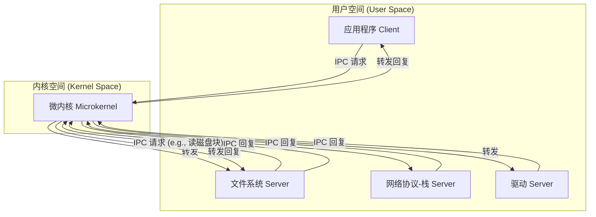
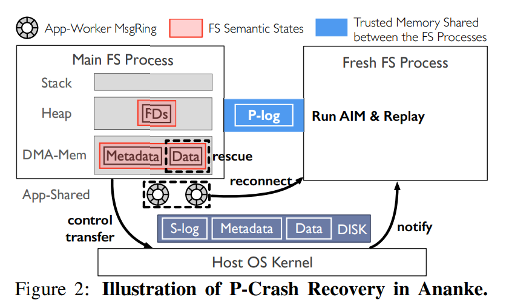
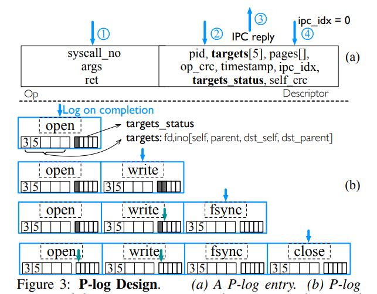
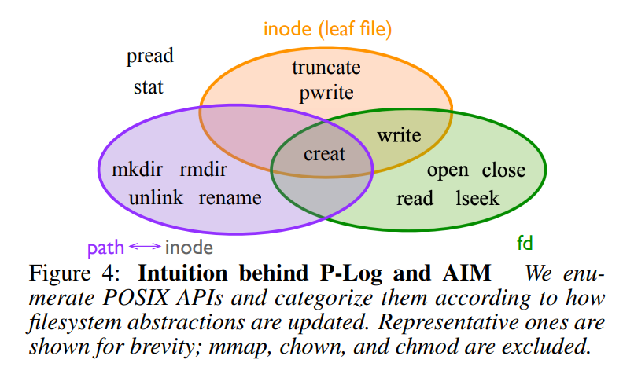

## 基本信息

- **论文**: Fast, Transparent Filesystem Microkernel Recovery with Ananke
- **作者**: Jing Liu (Microsoft Research), Yifan Dai, Andrea C. Arpaci-Dusseau, Remzi H. Arpaci-Dusseau (University of Wisconsin–Madison)
- **发表**: Fast2025

## 摘要

1.  **项目定位与目标 (What & Goal):**
    Ananke 是一个专为 **微内核 (microkernel)** 架构设计的高性能文件系统服务。其核心目标是解决微内核中用户态服务（如此处的文件系统）崩溃后的恢复问题，并致力于实现 **透明恢复 (transparent recovery)**，即恢复过程对上层应用程序是无感知的，不会导致应用中断或长时间卡顿。

2.  **核心技术与方法 (How):**
    Ananke 的实现利用了微内核架构的一个独特优势：当作为独立进程的文件系统服务崩溃时，**主机操作系统 (Host OS) 内核本身是稳定的**。Ananke 抓住这个时间窗口，在崩溃瞬间由主机 OS 协调执行一小段预设的恢复代码。这段代码能够访问并记录下在传统 **全系统崩溃 (full-system crash)** 场景下会彻底丢失的关键内存状态信息（如缓存内容、打开的文件句柄等）。

3.  **关键成果与验证 (Results & Validation):**
    论文通过严格的实验评估，证明了 Ananke 的设计是成功且高效的：
    *   **恢复的完整性**: 通过超过 **30,000 次故障注入 (fault-injection)** 实验，Ananke 证明了其可以实现 **无损恢复 (lossless recovery)**，确保了数据的持久性和一致性。
    *   **恢复的速度**: 恢复过程非常迅速，通常能在 **数百毫秒** 内完成，远快于传统的冷启动恢复，从而满足了透明性的要求。
    *   **运行时的性能**: 在正常情况下，Ananke 依然是一个高性能的文件系统。为了实现故障检测和恢复准备而增加的额外机制，其带来的 **运行时开销极小 (minimal overheads)**，不影响常规操作的效率。

## 知识点补充：微内核 (Microkernel) 

#### 1. 核心思想：最小化内核

微内核遵循 **“最小化”** 哲学，只在内核中保留操作系统最核心、不可或缺的功能。

*   **内核职责**：
    1.  **进程/线程管理与调度 (Scheduling)**
    2.  **内存管理 (Memory Management)**：主要是虚拟地址空间的管理。
    3.  **进程间通信 (Inter-Process Communication, IPC)**：这是微内核的基石。

*   **移出内核的服务**：所有非核心功能都被实现为运行在 **用户空间 (User Space)** 的独立服务进程 (Server)。
    *   文件系统 (Filesystems)
    *   设备驱动 (Device Drivers)
    *   网络协议栈 (Networking Stacks)
    *   图形界面 (GUI)

#### 2. 架构模型：客户端/服务端 (Client/Server)

整个操作系统被构建为一个由多个独立进程协作的分布式系统。

*   **服务进程 (Servers)**：提供特定的系统功能（如文件读写、网络收发）。
*   **客户端进程 (Clients)**：通常是应用程序，通过向服务进程发送请求来使用系统功能。
*   **通信方式**：所有交互都通过微内核提供的 **IPC 机制** 完成。

#### 3. 核心机制：IPC (进程间通信)

IPC 是微内核的“血脉”，所有系统调用最终都表现为进程间的消息传递。

*   **角色**：微内核是所有 IPC 的 **唯一中介和安全仲裁者**。
*   **功能**：负责消息的 **安全传递、进程同步和调度**。
*   **性能**：IPC 的效率直接决定了整个系统的性能。现代微内核采用 **页表映射** 等技术避免数据拷贝，以实现高性能 IPC。

#### 4. 关键优势

*   **可靠性与容错性 (Reliability & Fault Tolerance)**
    *   **故障隔离**：一个服务进程（如驱动）的崩溃不会影响到内核或其他服务，系统可以仅重启该服务来恢复功能，无需重启整个系统。
    *   **Ananke 论文的基石**：正是利用了这一点，即文件系统进程崩溃（p-crash）但内核和其他部分依然存活。

*   **安全性 (Security)**
    *   **最小攻击面**：内核代码量极少，漏洞更易于发现和修复。
    *   **权限分离**：每个服务进程只拥有完成其任务所需的最小权限，破坏性被限制在进程内部。

*   **灵活性与可扩展性 (Flexibility & Extensibility)**
    *   **模块化**：系统功能由独立的模块（进程）组成，可以轻松地替换、更新或添加新服务，而无需修改和重新编译内核。
    *   **可移植性**：只有微内核本身需要适配新的硬件架构，上层的服务进程可以保持不变。

#### 5. 主要挑战

*   **性能开销 (Performance Overhead)**
    *   频繁的 IPC 和上下文切换会带来性能损失。相比于宏内核内部的直接函数调用，跨进程的消息传递路径更长。
    *   这是微内核架构最主要的批评点，也是现代微内核（如 seL4）着力优化的方向。

*   **设计复杂性 (Design Complexity)**
    *   将系统功能拆分为多个协作的服务，需要精心设计 IPC 协议和处理复杂的异步交互，对开发者要求更高。

#### 6. 与宏内核 (Monolithic Kernel) 的根本区别

| 特性           | 微内核 (Microkernel)                  | 宏内核 (Monolithic Kernel)               |
| :------------- | :------------------------------------ | :--------------------------------------- |
| **架构**       | 客户端/服务端模型                     | 分层架构，所有服务在同一地址空间         |
| **服务位置**   | 用户空间进程                          | 内核空间模块                             |
| **通信机制**   | **IPC (进程间通信)** 是主要方式       | **函数调用 (Function Call)** 是主要方式  |
| **抽象层实现** | **由服务进程维护**，通过 IPC 接口暴露 | **由内核模块实现**，通过系统调用接口暴露 |
| **故障影响**   | **隔离**在一个进程内，可独立恢复      | 可能导致 **整个系统崩溃** (Kernel Panic) |
| **安全性**     | 攻击面小，权限分离                    | 攻击面大，一个驱动漏洞可威胁整个系统     |
| **性能**       | IPC 开销是瓶颈                        | 函数调用效率高，但内部结构复杂           |

## 1. 引言

1.  **背景 (Context)**:
    微内核架构因其可靠性被广泛应用，其核心特点是将操作系统服务（如文件系统）作为独立的用户进程运行。这种模式下的故障表现为 **进程级崩溃 (p-crash)**，而非整个系统崩溃。

2.  **核心问题 (Problem)**:
    文件系统进程 `p-crash` 后，其宝贵的 **内存状态**（如数据缓存、打开的文件）会全部丢失。传统的恢复方式只能依赖磁盘，速度极慢（数秒级），导致应用程序严重卡顿。作者将这种内存状态与磁盘状态的差异定义为 **“状态差距” (state gap)**。

3.  **解决方案 (Solution)**:
    论文提出 **Ananke** 系统，其核心思想是利用 `p-crash` 时 **操作系统内核依然存活** 这一独特优势。Ananke 的关键机制是一个由内核管理的 **内存日志 (p-log)**：
    *   **正常时**: 文件系统将关键操作的元数据写入 `p-log`。
    *   **崩溃时**: 内核保护 `p-log` 并将其 **转移** 给一个新启动的文件系统进程。
    *   **恢复时**: 新进程通过读取 `p-log` 快速重建内存状态。

4.  **成果 (Results)**:
    Ananke 实现了 **快速、透明的恢复**。实验证明，它能在 **400毫秒内** 完成恢复，且正常运行时的性能 **开销低于2%**，成功解决了微内核文件系统恢复缓慢的核心痛点。

## 2. 背景与延伸动机 

### 2.1 宏内核文件系统故障 ⇒ 全系统崩溃 

本节的核心观点是：在宏内核架构中，**文件系统的失败等同于整个系统的失败**。

1.  **崩溃模型：全系统崩溃 (s-crash)**
    *   由于文件系统代码与操作系统内核紧密耦合，任何文件系统的严重错误（如软件 Bug）都会直接导致内核崩溃，进而使整个系统宕机。
    *   这种崩溃与 **断电** 或 **硬重启** 在结果上没有区别：所有内存中的易失性数据全部丢失。

2.  **恢复机制与目标**
    *   恢复机制（如 `journaling`）完全依赖 **磁盘上的信息 (s-log)** 来进行。
    *   恢复的首要目标是保证文件系统的 **结构一致性 (consistency)**，确保其可以被重新挂载和使用，而 **不是保证不丢失任何数据 (no data loss)**。

3.  **主要后果与局限性**
    *   **数据丢失**: 因为性能优化（内存缓冲），最近写入的数据和元数据会因尚未落盘而 **永久丢失**。
    *   **应用崩溃**: 系统上运行的所有应用程序都会随之崩溃，丢失其所有内存状态和工作进度。
    *   **恢复缓慢**: 恢复过程本身可能非常耗时。传统方法 (`fsck`) 需要扫描全盘，速度极慢；即使是现代的日志方法，也需要一定时间处理日志，造成系统停机。

### 2.2 微内核文件系统故障 ⇒ 进程崩溃

本节的核心观点是：微内核的 **p-crash** 模型虽然带来了 **故障隔离** 的好处，但也暴露了一个全新的、严峻的挑战——**“状态差距” (state gap)**。

1. **崩溃模型：进程崩溃 (p-crash)**
   - 文件系统服务作为一个独立进程崩溃，但 **操作系统内核和其他应用程序依然存活**。这是微内核可靠性的体现。
2. **新挑战：“状态差距” (State Gap)**
   - 由于应用程序存活，它保留了对文件系统状态的“记忆”，但文件系统服务重启后，其内存状态全部丢失，只能从磁盘恢复。
   - 这就造成了 **应用程序的期望**（内存中的状态）与 **文件系统的现实**（磁盘上的状态）之间的严重不一致。
   - 传统的 s-crash 恢复机制（如 journal）无法解决这个问题，因为它只关心磁盘的一致性。
3. **后果**
   - **严重的数据丢失和逻辑错误**：应用程序会发现刚刚写入的数据“消失”了，或者文件状态（如文件名）回滚到了之前的状态。
   - **破坏了透明性**：这种不一致性对应用程序来说是灾难性的，使其无法继续正常运行，违背了微内核“无缝恢复”的理想目标。
   - **复杂性**：由于现代文件系统的 **乱序持久化** 特性，这个“状态差距”会变得非常复杂且难以追踪。

### 2.3 将 P-crash 恢复与 S-crash 恢复分离 

本节的核心论点是：**为 p-crash（进程崩溃）设计一套独立的、轻量级的恢复机制是极其必要且充满优势的，决不能将其与 s-crash（系统崩溃）的恢复机制混为一谈。**

1.  **必要性：现状无法满足需求**
    *   仅仅让文件系统进程在 `p-crash` 后自动重启是不够的。由于存在“状态差距”，像 LevelDB 这样的真实应用会直接崩溃，无法实现对用户的 **透明恢复**。

2.  **分离处理的三大好处**：
    *   **提升应用体验和正确性**: 专门的 `p-crash` 恢复可以弥补“状态差距”，让应用程序 **无感知地继续运行**，避免了繁琐且易错的手动数据修复。
    *   **降低复杂性和风险**: `p-crash`（由软件 Bug 引起）是 **高频** 事件，而 `s-crash`（如断电）是 **低频** 事件。为 `p-crash` 这种常见问题启用为 `s-crash` 设计的重量级 **故障转移 (Failover)** 方案，不仅是资源浪费，还会引入不必要的系统风险。
    *   **充分利用微内核优势**: 微内核架构使得 **重启一个用户进程非常快速和简单**。我们应该利用这个优势，实现本地化的快速恢复，而不是采用复杂的、跨机器的解决方案。

**一句话总结**：我们必须将 `p-crash` 视为一个独立的、更常见的问题来解决。为其设计专门的恢复机制，可以完美发挥微内核架构的优势，实现真正的高可用性，同时避免了重量级方案带来的复杂性和风险。

### 2.4 P-Crash 恢复的其他替代方案

本节通过 **排除法** 论证了 Ananke 方案的优越性。作者分析了三种看似可行的 p-crash 恢复替代方案，并逐一指出了它们的致命缺陷，从而反向证明了设计一个如 Ananke 这样的新方案的必要性。

1. **方案一：将 p-crash 升级为 s-crash (同归于尽)**
   - **做法**: 文件系统进程崩溃时，主动杀死所有相关应用或重启整个系统。
   - **缺陷**: **简单粗暴，完全放弃了微内核的优势**。这相当于为了避免“状态差距”问题，直接退回到了宏内核的故障模型，是一种倒退。
2. **方案二：由客户端负责恢复 (甩锅给应用)**
   - **做法**: 让应用程序自己追踪哪些操作成功了，哪些还在内存中，然后在恢复时进行重试。
   - **缺陷**: **极度复杂，不切实际**。这相当于将文件系统内部的复杂状态管理责任推给了上层应用，并且在多客户端环境下会引入复杂的分布式协调难题。
3. **方案三：禁用写缓冲，强制同步写入 (牺牲性能保平安)**
   - **做法**: 所有写操作都必须立刻落盘后才能返回成功。这样内存和磁盘就永远同步，没有“状态差距”。
   - **缺陷**: **性能灾难**。虽然它能实现透明恢复，但代价是正常运行时的性能会急剧下降到 **无法接受的程度**，违背了高性能的初衷。

**结论**:
以上三种替代方案都存在根本性的、无法接受的缺陷。它们要么放弃了微内核的优势，要么过于复杂，要么性能太差。

**Ananke 的价值**:
Ananke 在这里作为 **“最佳解决方案”** 登场。它成功地在 **高性能**（不牺牲正常运行时的吞吐量）和 **透明恢复** 之间取得了完美的平衡，实现了其他方案无法达成的目标。

### 2.5 体系化 P-Crash 恢复面临的挑战

本节通过定义 **理想 p-crash 恢复的五个核心挑战 (C1-C5)**，系统性地分析了现有相关工作的不足，并以此凸显 Ananke 设计的全面性和先进性。

1. **C1: 恢复状态差距** - **【基本功】**
   - **挑战**: 必须能精确恢复内存与磁盘的状态差异。
   - **现状**: 大多数相关系统都尝试解决这个问题，这是 p-crash 恢复的“入场券”。
2. **C2: 低性能开销** - **【效率】**
   - **挑战**: 恢复机制不能严重拖慢正常运行时的性能。
   - **Ananke 的优势**: 通过 p-log 避免了不必要的强制磁盘同步，做到了高性能和可恢复性的统一，优于 Membrane 等系统。
3. **C3: 处理内存损坏** - **【安全性】**
   - **挑战**: 故障可能源于内存损坏，恢复时不应信任和重用可能已损坏的内存区域。
   - **Ananke 的优势**: Ananke 不信任崩溃进程的地址空间，只依赖于 **内核保护的、明确定义的内存区域 (p-log)**，设计更安全。
4. **C4: 稳健的重启** - **【可靠性】**
   - **挑战**: 重启过程本身必须可靠，不能依赖于可能已损坏的旧进程资源（如线程、地址空间）。
   - **Ananke 的优势**: Ananke 采用 **启动一个全新进程和干净地址空间** 的策略，彻底隔离了故障，重启过程更稳健、更纯粹。
5. **C5: 迅速的错误检测** - **【前瞻性】**
   - **挑战**: 必须能尽早发现错误，防止错误状态扩散或被持久化。
   - **Ananke 的优势**: Ananke 内置了 **轻量级的、始终开启的校验机制**，能更早地发现内存损坏，提高了系统的整体稳健性。

**一句话总结**: Ananke 不仅仅解决了 p-crash 恢复的核心问题（恢复状态差距），更是在 **性能开销、对内存损坏的防御、重启的可靠性、以及错误检测的及时性** 这四个关键维度上，对现有工作进行了全面的改进和超越，提供了一个更体系化、更稳健的解决方案。

## 3. Ananke 设计

### 3.1 Ananke 的设计目标

本节明确了 Ananke 系统在设计时所追求的五个核心目标，这些目标共同定义了一个理想的 p-crash 恢复系统应该具备的特性。

1.  **透明恢复 (Transparency)**:
    恢复过程必须对应用程序 **完全无感**。这意味着不能有数据丢失，不能有逻辑错误，应用就像什么都没发生过一样继续运行。这是最终的用户体验目标。

2.  **高性能 (Performance)**:
    恢复机制不能以牺牲正常运行时的性能为代价。既然故障是小概率事件，那么系统在 **99.9% 的时间里都必须是高效的**。

3.  **现实故障模型 (Realism & Robustness)**:
    Ananke 不采用简化的 **“故障即停 (Fail-Stop)”** 模型，而是直面更现实、更复杂的故障场景。它假设故障可能导致 **内存损坏**，并在这种“不信任”的前提下设计恢复机制，以保证系统的稳健性。

4.  **快速恢复 (Speed)**:
    恢复过程本身必须 **足够快**，以尽量缩短应用程序的停顿时间，确保服务的高可用性。

5.  **易于集成 (Maintainability)**:
    该恢复机制应能以 **最小的侵入性** 集成到现有的复杂文件系统代码中，降低开发和维护成本。

**一句话总结**: Ananke 的目标是打造一个 **现实、稳健、高性能且对应用透明** 的快速恢复系统，同时还要易于在现有文件系统中实现。

### 3.2 Ananke 的基础架构

本节介绍了 Ananke 所基于的底层文件系统 **uFS** 的关键特性，为理解 Ananke 的恢复机制提供了背景知识。

1.  **uFS 的定位**:
    *   Ananke 是在 **uFS (a user-space File System)** 这个高性能、兼容 POSIX 的文件系统基础上构建的。
    *   uFS 作为一个 **用户态进程** 运行，通过 SPDK 驱动直接与存储设备交互，最大限度地减少了对内核的依赖。

2.  **核心架构特点**:
    *   **高性能设计**: 采用 **“每核一线程” (thread-per-core)** 架构，以实现高并发和良好的扩展性。
    *   **高效通信**: 应用程序通过 **共享内存中的环形缓冲区 (message ring buffers)** 与 uFS 服务进行通信，避免了传统系统调用的开销。
    *   **标准内部结构**: uFS 内部拥有现代文件系统所具备的典型内存数据结构，如 **页缓存、目录项缓存、inode 表** 等。

3.  **已有的恢复机制**:
    *   uFS 自身已经实现了基于 **Journaling (日志记录)** 的 **s-crash (全系统崩溃)** 恢复机制，即 `s-log`。

**一句话总结**: Ananke 建立在一个先进的、高性能的用户态文件系统 uFS 之上。uFS 已经具备了现代文件系统的核心要素和为 s-crash 设计的恢复机制，Ananke 的工作是在此基础上，专门为其增加一套针对 **p-crash (进程崩溃)** 的、全新的、透明的恢复能力。

### 3.3 节 Ananke 的设计原则与恢复流程

本节首先阐述了指导 Ananke 设计的四大核心原则，然后详细描述了基于这些原则的四步恢复流程，这与图 2 所示的过程完全对应。

#### 四大设计原则

这四大原则是 Ananke 设计的“灵魂”，直接对应了之前提出的五大挑战 (C1-C5)。

1.  **不强制刷盘 (No Force Flush)** - **【保证高性能】**
    *   **对应挑战**: C1 (恢复状态差距), C2 (低性能开销)
    *   **做法**: 允许数据在内存中缓冲，不为可恢复性牺牲性能。依赖 `P-log` 来追踪“状态差距”，而不是通过强制同步来消除它。

2.  **有限度地信任内存 (Limited Trust in Memory)** - **【保证安全性】**
    *   **对应挑战**: C3 (处理内存损坏)
    *   **做法**: 崩溃后，只信任由内核保护、并经过校验和/复制增强的 `P-log` (图中的蓝色块)。完全不信任旧进程的私有内存（图中的灰色区域）。

3.  **干净的重启 (Clean Restart)** - **【保证可靠性】**
    *   **对应挑战**: C4 (稳健的重启)
    *   **做法**: 彻底抛弃旧的 `Main FS Process`，启动一个全新的、地址空间干净的 `Fresh FS Process` (图右侧) 来执行恢复，杜绝故障蔓延。

4.  **快速失败 (Fail Fast)** - **【保证正确性】**
    *   **对应挑战**: C5 (迅速错误检测)
    *   **做法**: 在正常运行时就内置断言和校验和，尽早发现问题，避免将错误状态扩散或写入磁盘。

#### 四步恢复流程

这个流程是上述设计原则的具体体现：

1.  **步骤 1: 正常运行与记录 (Normal Execution & Logging)**
    *   **对应图 2**: 左侧的 `Main FS Process` 正常工作，处理来自 `App-Worker MsgRing` 的请求。
    *   **核心动作**: 每完成一个操作，就将其元数据写入到 **可信的 `P-log`** 中。当数据被持久化后，会更新 `P-log` 中的对应条目，标记其无需再恢复。

2.  **步骤 2: 崩溃检测与内核介入 (Error Detection & Kernel Intervention)**
    *   **对应图 2**: `Main FS Process` 发生 p-crash，`control transfer` 箭头指向 `Host OS Kernel`。
    *   **核心动作**: 内核接管控制权，**保护 `P-log`**，启动一个 `Fresh FS Process`，然后将 `P-log` 和 `MsgRing` 等资源 **转移 (reconnect)** 给新进程。旧进程被直接抛弃。

3.  **步骤 3: 新进程恢复 (Recovery in Fresh Process)**
    *   **对应图 2**: 右侧的 `Fresh FS Process` 执行 `Run AIM & Replay`。
    *   **核心动作**: 新进程首先执行标准的磁盘恢复 (`s-log recovery`)，然后读取 `P-log`，利用 **AIM 算法** 对其进行处理，并 **重放 (Replay)** 其中的操作，从而精确地在自己的干净内存中 **重建“状态差距”**。

4.  **步骤 4: 恢复服务 (Resume Service)**
    *   **对应图 2**: `Fresh FS Process` 完成恢复后，重新成为主服务进程。
    *   **核心动作**: 系统恢复正常，可以继续处理来自旧应用和新应用的请求。

**一句话总结**: Ananke 遵循 **“不刷盘、不信任、用新的、早发现”** 四大原则，设计了一个由内核协调的、分为 **“记录 → 崩溃 → 转移 → 重建”** 四个步骤的恢复流程。该流程的核心是利用一个受保护的 `P-log` 作为可信媒介，在一个全新的进程中安全、快速地重建因 `p-crash` 而丢失的内存状态。

### 3.4 Ananke 的三大核心机制

本节详细介绍了 Ananke 为实现其设计目标而采用的三大关键技术机制，这些机制分别应对了之前提出的 C1-C5 挑战。

1.  **可信 P-log 与 AIM 算法 (Trusted P-log & AIM)** - **【负责正确恢复】**
    *   **应对挑战**: C1 (恢复状态差距), C2 (低性能开销), C3 (处理内存损坏)
    *   **P-log**: 是一个位于受保护共享内存中的 **日志**，通过 **校验和与复制** 保证其可信性。它是故障后唯一可信的内存区域，记录了所有可能导致“状态差距”的操作。
    *   **AIM 算法**: 一个智能的 **重放决策算法**。它读取 `p-log`，并根据文件系统的当前持久化状态，决定对每条日志记录是 **执行 (Act)**、**忽略 (Ignore)** 还是 **修改后执行 (Modify)**。这解决了因乱序持久化等问题导致的简单重放不可行的问题。

2.  **内核协调的推测性重启 (Kernel-coordinated Speculative Restart)** - **【负责快速重启】**
    *   **应对挑战**: C4 (稳健的重启)
    *   **核心思想**: 为了让恢复过程“快人一步”，Ananke 采用 **预备方案**。
    *   **具体做法**:
        *   **内核协调**: 内核能 **迅速检测** 到主进程的任何崩溃，并立即启动恢复流程。
        *   **推测性重启**: 在主文件系统进程启动时，就 **并行地** 启动一个“备胎”进程。这个备胎进程会提前完成所有耗时的初始化工作（如连接设备），然后进入休眠。一旦主进程崩溃，内核只需唤醒这个“万事俱备”的备胎即可，极大地缩短了恢复启动时间。

3.  **轻量级的损坏检测 (Lightweight Corruption Detection)** - **【负责尽早发现问题】**
    *   **应对挑战**: C5 (迅速错误检测)
    *   **核心思想**: **主动防御，早发现早治疗 (Fail Fast)**。
    *   **具体做法**: 为内存中所有关键的语义数据结构（如图 2 中的红色框区域）都加上 **轻量级校验和**。每次访问这些数据时都会进行验证。
    *   **重要澄清**: 这些校验和的 **唯一目的** 是 **触发崩溃**，即一旦发现内存被污染就立即让进程崩溃，防止错误扩散。它们并 **不用于** 恢复，因为恢复过程只信任 `p-log`。

**一句话总结**: Ananke 通过 **P-log + AIM 算法** 解决了“恢复什么和怎么恢复”的核心问题，通过 **推测性重启** 解决了“如何快速启动恢复”的效率问题，并通过 **轻量级校验和** 解决了“如何尽早发现故障”的稳健性问题。这三大机制共同构成了一个完整、高效且可靠的 p-crash 恢复体系。

### 3.5 P-log 的精巧设计

本节深入剖析了 Ananke 核心数据结构 **p-log** 的设计与工作原理，其精髓体现在图 3 中。

1.  **核心目的与结构**:
    *   p-log 的目标是 **精确追踪导致“状态差距”的操作**。它是一个由多个高可靠性（复制、无指针）的 **每核私有环形缓冲区** 组成的日志系统。

2.  **日志条目的关键设计 (图 3a)**:
    *   每个日志条目不仅记录了操作本身 (`syscall`, `args`)，更关键的是包含了一个 **`Descriptor` (描述符)**。
    *   描述符的核心是 **`targets` 数组** 和 **`targets_status` 位图**。`targets` 记录操作影响的对象（如 `fd=3`, `ino=5`），而 `targets_status` 中的每一位（图中的黑/白方块）则实时标记对应对象的状态是否 **“脏”**（即仍是状态差距的一部分）。

3.  **动态工作流程 (图 3b)**:
    *   **日志写入 (蓝色箭头)**: 每当一个操作（如 `open`, `write`）完成，会向 p-log 追加一条新日志，并根据其对内存状态的影响 **设置 `targets_status` 的对应位为 1（涂黑）**。
    *   **状态更新 (绿色箭头)**: 当后续操作（如 `fsync`, `close`）将内存中的状态 **持久化到磁盘** 时，Ananke 会 **回头修改** p-log 中所有相关条目，将 `targets_status` 的对应位 **清零（洗白）**。
    *   **精确追踪**: 通过这种动态的“涂黑”与“洗白”，`targets_status` 位图在任何时刻都精确地反映了哪些操作的哪些影响仍未落盘，构成了当前的“状态差距”。

**一句话总结**: p-log 的设计核心是通过 **`targets_status` 位图** 实现了对“状态差距”的 **动态、细粒度追踪**。它不仅记录了“做过什么”，更重要的是实时更新了“哪些影响还没落盘”，为恢复时做出精确、高效的重放决策提供了至关重要的数据基础。

### 3.6 AIM 算法——智能的状态重建引擎

本节详细阐述了 Ananke 的“大脑”——**AIM (Act-Ignore-Modify) 算法**。该算法的核心任务是解析 `p-log`，并智能地决定如何精确重建因 `p-crash` 而丢失的“状态差距”。图 4 为理解 AIM 的工作哲学提供了完美的理论模型。

#### 1. 理论基础：基于三大抽象的分类 (图 4)

AIM 的核心思想源于对文件系统操作本质的深刻理解。它将所有操作按其影响的 **核心抽象** 进行分类，如图 4 的 Venn 图所示：

*   **fd (文件描述符)**: 临时、进程私有的状态，如文件偏移量。
*   **inode (索引节点)**: 持久的、全局的文件实体状态，如数据和元数据。
*   **path↔inode (路径到 inode 映射)**: 持久的、全局的目录结构状态。

图 4 清晰地展示了不同操作如何影响一种或多种抽象。例如，`write` 同时影响 `fd` 和 `inode`，而 `creat` 则同时影响全部三种。这个分类模型是 AIM 做出决策的理论基石。

#### 2. 核心算法：Act, Ignore, Modify

AIM 算法在恢复时遍历 p-log，对每一条日志，根据其 `targets_status` 位图（反映了哪些影响已被持久化）做出以下三种决策之一：

*   **Ignore (忽略)**:
    *   **条件**: 当一个操作的所有影响都已被持久化（即 `targets_status` 所有位都为 0）。
    *   **含义**: 这个操作已经完全体现在磁盘上，无需任何恢复动作。这也是 p-log 条目可以被 **垃圾回收** 的信号。

*   **Act (执行)**:
    *   **条件**: 当一个操作的所有影响都还存在于“状态差距”中（即 `targets_status` 中相关的位都为 1），且其执行前提未被后续持久化操作改变。
    *   **含义**: 这个操作就像刚发生一样，需要被 **原封不动地重放** 以重建状态。

*   **Modify (修改)**:
    *   **条件**: 当一个操作的部分影响已被持久化，而另一部分仍在“状态差距”中（`targets_status` 中部分位为 1，部分为 0）。
    *   **含义**: 这是 AIM 最精髓的部分。算法会将原始操作 **“降级” (Degrade)** 为一个或多个更简单的操作，这些简单操作只产生那些 **尚未被持久化的“剩余效果”**。

#### 3. “降级”的可视化解释 (图 4)

图 4 直观地解释了“降级”的过程，即一个操作从图中重叠度高的区域“移动”到重叠度低的区域：

*   **`write` 降级为 `lseek`**: `write`（跨 `fd` 和 `inode` 圈）的数据部分 (`inode` 影响) 被持久化后，只剩下文件偏移量 (`fd` 影响) 未持久化。因此，它被修改为只影响 `fd` 圈的 `lseek`。
*   **`creat` 降级为 `open` 或 `CreatReuseDInode`**: `creat`（跨三个圈）的 `inode` 和 `path↔inode` 影响被持久化后，只剩下返回一个 `fd` 的效果。因此，它被修改为只影响 `fd` 圈的 `open` 或类似的内部 API。

通过这种方式，AIM 巧妙地 **复用了文件系统已有的、经过充分测试的 API** 来完成状态重建，而不是重新发明一套复杂的恢复逻辑。

#### 4. 算法的完备性

AIM 不仅决定操作类型，还处理了其他复杂问题：

*   **参数修改**: 如 `rename` 例子所示，AIM 会根据 p-log 中的后续持久化记录，智能地修改重放操作的参数（如路径名）。
*   **物理依赖**: AIM 通过追踪 `inode` 级别的状态变化，能自动处理由底层存储布局（如 imap）引起的复杂物理依赖。
*   **并发处理**: 通过每核私有 p-log 和时间戳机制，优雅地处理了多核环境下的并发问题。

**一句话总结**: AIM 算法是一个基于 **文件系统核心抽象模型 (图 4)** 的智能决策引擎。它通过分析 p-log 中每个操作影响的持久化程度，对日志条目做出 **执行 (Act)、忽略 (Ignore) 或降级修改 (Modify)** 的决策，从而能够精确、高效且稳健地重建因 p-crash 丢失的内存状态。

> AIM 算法是一个 **上层逻辑恢复引擎**，它通过智能重放 API 调用来弥补“状态差距”；而底层的 **物理一致性** 则完全委托给文件系统自身的事务机制来保障。二者分工明确，互为补充。